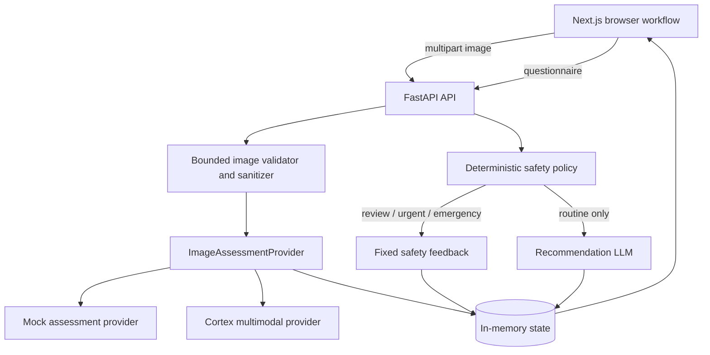

# SkinSense Africa

SkinSense Africa is a safety-guarded, AI-assisted skin assessment prototype
designed with melanin-rich skin tones in mind. A user uploads one skin image,
receives a preliminary visual assessment, answers a structured safety
questionnaire, and—only when deterministic safety rules permit it—receives
educational guidance.

> [!IMPORTANT]
> SkinSense Africa is an educational prototype, not a medical device and not a
> substitute for diagnosis or care from a qualified healthcare professional.
> Urgent, emergency, uncertain, and otherwise unsafe cases are deliberately
> blocked from AI-generated treatment-like recommendations.

## Contents

- [What the application does](#what-the-application-does)
- [Safety model](#safety-model)
- [Architecture](#architecture)
- [Technology stack](#technology-stack)
- [Repository layout](#repository-layout)
- [Prerequisites](#prerequisites)
- [Quick start](#quick-start)
- [Linux setup](#linux-setup)
- [macOS setup](#macos-setup)
- [Windows setup](#windows-setup)
- [Environment configuration](#environment-configuration)
- [Running the application](#running-the-application)
- [Google Cloud Run backend deployment](#google-cloud-run-backend-deployment)
- [Testing](#testing)
- [Cortex smoke tests](#cortex-smoke-tests)
- [API reference](#api-reference)
- [Assessment lifecycle](#assessment-lifecycle)
- [Image and data handling](#image-and-data-handling)
- [Troubleshooting](#troubleshooting)
- [Current limitations](#current-limitations)
- [Production-readiness checklist](#production-readiness-checklist)
- [Further documentation](#further-documentation)

## What the application does

The current workflow is:

1. Create an assessment session.
2. Select one JPEG, PNG, or WebP skin image.
3. Validate, decode, orient, sanitize, and assess the image.
4. Show a preliminary condition, qualitative confidence, image-quality result,
   and any controlled visual findings.
5. Collect a strict symptom and safety questionnaire.
6. Evaluate deterministic safety rules.
7. Take one of two paths:
   - **Routine:** invoke the recommendation engine separately and show
     educational guidance.
   - **Professional review, urgent, or emergency:** do not invoke the
     recommendation model. Show fixed safety feedback, exact trigger
     explanations, next steps, and a copyable clinician summary.

Supported preliminary condition labels are:

- acne
- eczema
- folliculitis
- fungal infection
- impetigo
- psoriasis
- scabies
- other or uncertain

Unknown provider labels are normalized to `other_or_uncertain`; they do not
receive condition-specific recommendations.

## Safety model

Safety is controlled by backend code, not by either AI invocation.

The deterministic precedence is:

1. **Emergency** — reported difficulty breathing or swelling of the lips,
   tongue, or throat.
2. **Urgent** — rapid spread, high fever, severe pain, eye involvement,
   extensive blistering, possible infection, significant bleeding, an open
   wound, or corresponding controlled visual warning signals.
3. **Professional review** — uncertain condition, low confidence, inadequate
   image quality, persistent or recurrent concern, relevant `unsure` answers,
   fever or swelling, or unsupported scope.
4. **Routine** — no higher-priority rule was triggered.

The image assessment and recommendation are separate provider calls:

- The **image-assessment invocation** receives only the sanitized image and a
  guarded assessment prompt.
- The **recommendation invocation** receives structured assessment,
  questionnaire, and safety context. It never receives the image, Base64,
  image path, image URL, filename, or EXIF.
- The recommendation invocation is skipped entirely unless the backend safety
  result has `recommendation_permission=allowed`.

## Architecture



The backend follows a layered structure:

- `domain` owns strict models, enums, condition normalization, and safety
  policy.
- `application` orchestrates assessment and recommendation use cases.
- `infrastructure` contains mock, Cortex, image-processing, and LLM adapters.
- `api` owns HTTP routes, dependency wiring, stable errors, and prototype
  repositories.

Provider output cannot set backend-owned fields such as urgency, safety
permission, engine identity, timestamps, limitations, or final recommendation
status.

## Technology stack

| Area | Technology |
|---|---|
| Frontend | Next.js 15, React 19, TypeScript 5, Tailwind CSS 3 |
| Backend | Python, FastAPI, Pydantic 2, Uvicorn |
| Image processing | Pillow |
| Tests | Pytest, HTTPX2 ASGI transport |
| Live AI gateway | Cortex, using Gemini-compatible `generateContent` endpoints |
| Default local AI | Deterministic mock assessment and recommendation providers |
| Persistence | Process-local in-memory repositories |

The project is currently verified with:

- Python 3.12
- Node.js 18.19

Python 3.12 is recommended. The code requires Python 3.10 or newer. The
installed Next.js version accepts Node.js `^18.18.0`, `^19.8.0`, or `>=20.0.0`;
an active Node.js LTS release is recommended.

## Repository layout

```text
skinSenseAfrica/
├── backend/
│   ├── app/
│   │   ├── api/                    # Routes, errors, DI, in-memory repositories
│   │   ├── application/            # Assessment/recommendation orchestration
│   │   ├── domain/                 # Strict contracts and deterministic policy
│   │   ├── infrastructure/         # Cortex, mock, image and LLM adapters
│   │   ├── main.py                 # FastAPI entrypoint
│   │   └── settings.py             # Typed environment configuration
│   ├── scripts/                    # Demo and opt-in live smoke tests
│   ├── tests/                      # Backend unit, API and scenario tests
│   ├── .env.example                # Safe configuration template
│   └── requirements.txt
├── frontend/
│   ├── src/
│   │   ├── app/                    # Next.js App Router pages
│   │   ├── components/             # Assessment and result UI
│   │   ├── features/assessment/    # API, types, validation and state
│   │   ├── lib/                    # Shared API client and constants
│   │   └── styles/
│   ├── package.json
│   └── package-lock.json
├── docs/                            # Feature design and implementation records
└── README.md
```

## Prerequisites

Install these before continuing:

- Git
- Python 3.10 or newer; Python 3.12 recommended
- Node.js 18.18 or newer; an active LTS version recommended
- npm, normally installed with Node.js

Confirm the tools are available:

```bash
git --version
python3 --version
node --version
npm --version
```

On Windows, use `py --version` if `python` is not available.

No database, Docker installation, mobile SDK, or provider account is required
for the default mock-mode setup.

## Quick start

These commands are for Linux, macOS, WSL, or Git Bash:

```bash
git clone https://github.com/2024bse134-afk/skinSenseAfrica.git
cd skinSenseAfrica

python3 -m venv backend/.venv
source backend/.venv/bin/activate
python -m pip install --upgrade pip
python -m pip install -r backend/requirements.txt
cp backend/.env.example backend/.env

cd frontend
npm ci
cd ..
```

Start the backend in terminal 1:

```bash
cd backend
source .venv/bin/activate
uvicorn app.main:app --reload --host 127.0.0.1 --port 8000
```

Start the frontend in terminal 2:

```bash
cd frontend
npm run dev
```

Open:

- Application: <http://127.0.0.1:3000>
- Interactive API documentation: <http://127.0.0.1:8000/docs>

The copied `.env.example` uses both mock providers, so the complete workflow
works without network calls or API keys.

## Linux setup

### 1. Install operating-system packages

Ubuntu or Debian:

```bash
sudo apt update
sudo apt install -y git python3 python3-venv python3-pip
```

Install a current Node.js LTS release using your preferred package manager or a
version manager such as `nvm`. Distribution repositories can carry an older
Node version, so check `node --version` after installation.

Fedora:

```bash
sudo dnf install git python3 python3-pip
```

Arch Linux:

```bash
sudo pacman -S git python nodejs npm
```

### 2. Clone and install

```bash
git clone https://github.com/2024bse134-afk/skinSenseAfrica.git
cd skinSenseAfrica

python3 -m venv backend/.venv
source backend/.venv/bin/activate
python -m pip install --upgrade pip
python -m pip install -r backend/requirements.txt
cp backend/.env.example backend/.env

cd frontend
npm ci
cd ..
```

If your distribution does not provide `python3 -m venv`, install its
`python3-venv` package. WSL users can follow the same Linux instructions from
inside the WSL filesystem.

## macOS setup

Install Homebrew if it is not already available, then install the prerequisites:

```bash
brew install git python@3.12 node
```

Clone and install:

```bash
git clone https://github.com/2024bse134-afk/skinSenseAfrica.git
cd skinSenseAfrica

python3 -m venv backend/.venv
source backend/.venv/bin/activate
python -m pip install --upgrade pip
python -m pip install -r backend/requirements.txt
cp backend/.env.example backend/.env

cd frontend
npm ci
cd ..
```

Apple Silicon and Intel Macs use the same project commands. Pillow wheels are
normally installed automatically; a local image-library toolchain should not be
needed.

## Windows setup

The recommended native Windows terminal is PowerShell.

### 1. Install prerequisites

Install:

- Git for Windows
- Python 3.12, with **Add Python to PATH** enabled
- A current Node.js LTS release

Open a new PowerShell window and verify:

```powershell
git --version
py -3.12 --version
node --version
npm --version
```

### 2. Clone and install

```powershell
git clone https://github.com/2024bse134-afk/skinSenseAfrica.git
Set-Location skinSenseAfrica

py -3.12 -m venv backend\.venv
backend\.venv\Scripts\Activate.ps1
python -m pip install --upgrade pip
python -m pip install -r backend\requirements.txt
Copy-Item backend\.env.example backend\.env

Set-Location frontend
npm ci
Set-Location ..
```

If PowerShell blocks virtual-environment activation, allow scripts only for the
current terminal:

```powershell
Set-ExecutionPolicy -Scope Process -ExecutionPolicy Bypass
backend\.venv\Scripts\Activate.ps1
```

This does not permanently change the machine-wide execution policy.

### 3. Run on Windows

Backend terminal:

```powershell
Set-Location path\to\skinSenseAfrica\backend
.\.venv\Scripts\Activate.ps1
uvicorn app.main:app --reload --host 127.0.0.1 --port 8000
```

Frontend terminal:

```powershell
Set-Location path\to\skinSenseAfrica\frontend
npm run dev
```

For classic Command Prompt, activate the environment with:

```bat
backend\.venv\Scripts\activate.bat
```

## Environment configuration

Backend settings are loaded from `backend/.env`. Always run Uvicorn from the
`backend` directory so that this file is discovered consistently.

Create the local file once:

Linux and macOS:

```bash
cp backend/.env.example backend/.env
```

Windows PowerShell:

```powershell
Copy-Item backend\.env.example backend\.env
```

`backend/.env` is ignored by Git. Never commit real API keys. Do not put
provider credentials in a `NEXT_PUBLIC_*` variable because those variables are
bundled into browser code.

### Configuration reference

| Variable | Default/template | Purpose |
|---|---|---|
| `LLM_PROVIDER` | `mock` | Recommendation provider: `mock`, `cortex`, or `gemini` |
| `LLM_API_KEY` | empty | Server-side recommendation credential |
| `LLM_MODEL` | empty | Recommendation model name |
| `LLM_BASE_URL` | empty | Required Cortex gateway origin for recommendations |
| `LLM_TIMEOUT_SECONDS` | `30` | Recommendation request timeout |
| `CLASSIFIER_PROVIDER` | `mock` | Legacy classifier setting; active image flow uses the assessment provider |
| `RECOMMENDATION_PROMPT_VERSION` | `v1` | Recommendation prompt configuration |
| `IMAGE_ASSESSMENT_PROVIDER` | `mock` | Image provider: `mock` or `cortex` |
| `IMAGE_ASSESSMENT_PROMPT_VERSION` | `image-assessment-v1` | Guarded assessment prompt version |
| `IMAGE_ASSESSMENT_SCHEMA_VERSION` | `v1` | Strict provider response schema |
| `IMAGE_ASSESSMENT_TIMEOUT_SECONDS` | `20` | Overall image-provider deadline |
| `IMAGE_ASSESSMENT_MAX_RETRIES` | `1` | Retry count; accepted range is 0–1 |
| `IMAGE_ASSESSMENT_MAX_OUTPUT_TOKENS` | `800` | Provider output cap; accepted range is 1–4096 |
| `IMAGE_ASSESSMENT_TEMPERATURE` | `0.1` | Assessment sampling temperature |
| `IMAGE_ASSESSMENT_MAX_BYTES` | `8388608` | Maximum upload size: 8 MiB |
| `IMAGE_ASSESSMENT_MAX_PIXELS` | `20000000` | Maximum decoded image pixel count |
| `IMAGE_ASSESSMENT_MIN_SIDE` | `320` | Minimum width and height |
| `IMAGE_ASSESSMENT_MAX_IMAGES` | `1` | Single-image invariant |
| `CORTEX_API_KEY` | empty | Server-side Cortex image-assessment credential |
| `CORTEX_BASE_URL` | project gateway | Cortex gateway origin for image assessment |
| `CORTEX_IMAGE_MODEL` | `gemini-2.5-flash` | Cortex multimodal model |
| `SAFETY_POLICY_VERSION` | `v1` | Recorded deterministic policy version |
| `SEVERE_PAIN_THRESHOLD` | `7` | Pain score that enters the urgent branch |
| `CONFIDENCE_RETAKE_THRESHOLD` | `0.60` | Prototype confidence threshold |
| `CONFIDENCE_CAUTIOUS_THRESHOLD` | `0.80` | Prototype cautious-guidance threshold |

### Profile A: fully local mock mode

This is the recommended development and test profile:

```dotenv
LLM_PROVIDER=mock
LLM_API_KEY=
LLM_MODEL=
LLM_BASE_URL=

IMAGE_ASSESSMENT_PROVIDER=mock
CORTEX_API_KEY=
```

No assessment or recommendation data leaves the machine in this profile.

### Profile B: Cortex assessment and Cortex recommendation

Assessment and recommendation are still two separate invocations:

```dotenv
IMAGE_ASSESSMENT_PROVIDER=cortex
CORTEX_API_KEY=replace-with-server-side-image-assessment-key
CORTEX_BASE_URL=https://your-approved-cortex-gateway.example
CORTEX_IMAGE_MODEL=gemini-2.5-flash
IMAGE_ASSESSMENT_TIMEOUT_SECONDS=40
IMAGE_ASSESSMENT_MAX_OUTPUT_TOKENS=4096

LLM_PROVIDER=cortex
LLM_API_KEY=replace-with-server-side-recommendation-key
LLM_BASE_URL=https://your-approved-cortex-gateway.example
LLM_MODEL=gemini-2.5-flash
LLM_TIMEOUT_SECONDS=30
```

The two credentials may be issued from the same service, but both environment
variables must be populated because the providers are configured independently.
Use separate scoped credentials when the gateway supports them.

### Profile C: mock image assessment and Gemini recommendation

```dotenv
IMAGE_ASSESSMENT_PROVIDER=mock

LLM_PROVIDER=gemini
LLM_API_KEY=replace-with-server-side-gemini-key
LLM_MODEL=replace-with-approved-model-name
```

Direct Gemini support currently applies only to the recommendation client.
Image assessment supports `mock` and `cortex`.

### Frontend API configuration

The default frontend API base is `/api`. Next.js rewrites this path to
`http://127.0.0.1:8000`, so local development needs no frontend environment
file.

To point the browser at a different API origin, create
`frontend/.env.local`:

```dotenv
NEXT_PUBLIC_API_BASE_URL=https://api.example.com
```

Restart Next.js after changing `.env.local`. For a separate browser-visible
origin, update backend CORS configuration or place both applications behind a
same-origin reverse proxy. The current backend CORS allow-list contains only
`http://localhost:3000` and `http://127.0.0.1:3000`.

## Running the application

Run the backend and frontend in separate terminals.

### Backend development server

Linux/macOS:

```bash
cd backend
source .venv/bin/activate
uvicorn app.main:app --reload --host 127.0.0.1 --port 8000
```

Windows PowerShell:

```powershell
Set-Location backend
.\.venv\Scripts\Activate.ps1
uvicorn app.main:app --reload --host 127.0.0.1 --port 8000
```

### Frontend development server

```bash
cd frontend
npm run dev
```

Open <http://127.0.0.1:3000>.

### Local-network access

To test the frontend from another device on the same trusted network:

```bash
cd frontend
npm run dev -- --hostname 0.0.0.0
```

Then browse to `http://<development-machine-ip>:3000`. The default `/api`
rewrite still reaches the backend on the development machine. Do not expose the
prototype directly to an untrusted or public network.

### Production-mode build check

Frontend:

```bash
cd frontend
npm run build
npm run start
```

Backend, without auto-reload:

```bash
cd backend
source .venv/bin/activate
uvicorn app.main:app --host 127.0.0.1 --port 8000
```

These commands validate production compilation and serving behavior; they do
not make the current prototype production-ready.

### Stop the servers

Press `Ctrl+C` in each server terminal.

## Google Cloud Run backend deployment

The frontend can remain local while the FastAPI backend runs on Cloud Run.

### Current prototype deployment

| Setting | Value |
|---|---|
| Google Cloud project | Tathmini (`tathmini-499518`) |
| Region | `us-central1` |
| Cloud Run service | `skinsense-backend` |
| Backend URL | <https://skinsense-backend-240757536793.us-central1.run.app> |
| Runtime image | Built from `backend/Dockerfile` |
| Credential storage | Secret Manager: `skinsense-cortex-api-key` |
| Scaling | 0–1 instance |
| Public access | Enabled for the prototype browser workflow |

The project already contains an unrelated service named `tathmini-backend`.
Do not deploy SkinSense under that name.

`backend/.gcloudignore` excludes `.env`, virtual environments, tests, scripts,
and test images from the Cloud Build source upload. The runtime container runs
as an unprivileged user.

### Google Cloud prerequisites

Install and authenticate the Google Cloud CLI:

```bash
gcloud auth login
gcloud auth list
gcloud projects list
```

If multiple accounts are signed in, use explicit `--account` and `--project`
flags on every command. This avoids changing or deploying to an unrelated
active configuration.

Required project services are:

```bash
gcloud services enable \
  run.googleapis.com \
  cloudbuild.googleapis.com \
  artifactregistry.googleapis.com \
  secretmanager.googleapis.com \
  --project=YOUR_PROJECT_ID \
  --account=YOUR_GOOGLE_ACCOUNT
```

The deploying account needs permission to build images, deploy Cloud Run
services, manage the selected secret, and act as the runtime service account.

### Store the provider credential

Never pass the actual provider key through `--set-env-vars` and never add it to
the Dockerfile.

From the repository root on Linux/macOS, the following creates the secret from
the ignored local `backend/.env` without putting its value in the command-line
arguments:

```bash
set -a
source backend/.env
printf '%s' "$CORTEX_API_KEY" | gcloud secrets create skinsense-cortex-api-key \
  --project=YOUR_PROJECT_ID \
  --account=YOUR_GOOGLE_ACCOUNT \
  --replication-policy=automatic \
  --data-file=-
set +a
```

Create a new secret version instead when the secret already exists:

```bash
set -a
source backend/.env
printf '%s' "$CORTEX_API_KEY" | gcloud secrets versions add skinsense-cortex-api-key \
  --project=YOUR_PROJECT_ID \
  --account=YOUR_GOOGLE_ACCOUNT \
  --data-file=-
set +a
```

Grant the Cloud Run runtime service account access to that secret:

```bash
PROJECT_NUMBER="$(gcloud projects describe YOUR_PROJECT_ID \
  --account=YOUR_GOOGLE_ACCOUNT \
  --format='value(projectNumber)')"

gcloud secrets add-iam-policy-binding skinsense-cortex-api-key \
  --project=YOUR_PROJECT_ID \
  --account=YOUR_GOOGLE_ACCOUNT \
  --member="serviceAccount:${PROJECT_NUMBER}-compute@developer.gserviceaccount.com" \
  --role=roles/secretmanager.secretAccessor
```

The current prototype uses the same gateway credential for both invocations,
but maps it to separate runtime variables:

- `CORTEX_API_KEY` for image assessment
- `LLM_API_KEY` for recommendation generation

Use separate Secret Manager secrets if separate scoped credentials are issued.

### Deploy or update the backend

Run from the repository root:

```bash
gcloud run deploy skinsense-backend \
  --source=backend \
  --region=us-central1 \
  --project=YOUR_PROJECT_ID \
  --account=YOUR_GOOGLE_ACCOUNT \
  --allow-unauthenticated \
  --port=8080 \
  --cpu=1 \
  --memory=512Mi \
  --concurrency=20 \
  --timeout=120s \
  --min-instances=0 \
  --max-instances=1 \
  --execution-environment=gen2 \
  --set-secrets="CORTEX_API_KEY=skinsense-cortex-api-key:latest,LLM_API_KEY=skinsense-cortex-api-key:latest" \
  --set-env-vars="IMAGE_ASSESSMENT_PROVIDER=cortex,IMAGE_ASSESSMENT_PROMPT_VERSION=image-assessment-v1,IMAGE_ASSESSMENT_SCHEMA_VERSION=v1,IMAGE_ASSESSMENT_TIMEOUT_SECONDS=40,IMAGE_ASSESSMENT_MAX_RETRIES=1,IMAGE_ASSESSMENT_MAX_OUTPUT_TOKENS=4096,IMAGE_ASSESSMENT_TEMPERATURE=0.1,IMAGE_ASSESSMENT_MAX_BYTES=8388608,IMAGE_ASSESSMENT_MAX_PIXELS=20000000,IMAGE_ASSESSMENT_MIN_SIDE=320,IMAGE_ASSESSMENT_MAX_IMAGES=1,CORTEX_BASE_URL=https://cortex-ai-gateway-zo7vz3jvhq-uc.a.run.app,CORTEX_IMAGE_MODEL=gemini-2.5-flash,LLM_PROVIDER=cortex,LLM_MODEL=gemini-2.5-flash,LLM_BASE_URL=https://cortex-ai-gateway-zo7vz3jvhq-uc.a.run.app,LLM_TIMEOUT_SECONDS=30,CLASSIFIER_PROVIDER=mock,RECOMMENDATION_PROMPT_VERSION=v1,SAFETY_POLICY_VERSION=v1,SEVERE_PAIN_THRESHOLD=7,CONFIDENCE_RETAKE_THRESHOLD=0.60,CONFIDENCE_CAUTIOUS_THRESHOLD=0.80" \
  --labels="application=skinsense-africa,component=backend,environment=prototype"
```

Cloud Build builds the Dockerfile, pushes the image to Artifact Registry, and
routes traffic to the new revision only after the container starts
successfully.

### Verify the deployment

```bash
BACKEND_URL="https://your-cloud-run-service-url"

curl "$BACKEND_URL/health"
curl "$BACKEND_URL/openapi.json"
```

Expected health response:

```json
{"status":"ok"}
```

Inspect the active revision without displaying secret values:

```bash
gcloud run services describe skinsense-backend \
  --region=us-central1 \
  --project=YOUR_PROJECT_ID \
  --account=YOUR_GOOGLE_ACCOUNT \
  --format="yaml(status.url,status.latestReadyRevisionName,status.traffic)"
```

### Keep the frontend local

Set the public backend URL in the ignored `frontend/.env.local` file:

```dotenv
NEXT_PUBLIC_API_BASE_URL=https://your-cloud-run-service-url
```

Restart `npm run dev` after changing this file. The current local backend CORS
allow-list supports both `http://localhost:3000` and
`http://127.0.0.1:3000`.

For the current deployment:

```dotenv
NEXT_PUBLIC_API_BASE_URL=https://skinsense-backend-240757536793.us-central1.run.app
```

### Cloud Run prototype caveats

- Public unauthenticated access is required by the current browser workflow,
  but also exposes paid provider routes to abuse. Add authentication, rate
  limits, quotas, and abuse controls before broader access.
- `max-instances=1` reduces cross-instance state loss but does not make memory
  durable. Scale-to-zero, restarts, new revisions, and infrastructure
  replacement can erase every assessment.
- Use a durable database before multi-instance scaling or real user use.
- `min-instances=0` minimizes idle cost. Setting it to 1 can reduce cold starts
  but incurs ongoing cost and still does not guarantee durable state.
- Cloud Run and provider request charges apply to live Cortex use.

## Testing

### Backend test suite

Linux/macOS:

```bash
cd backend
source .venv/bin/activate
python -m pytest -q
```

Windows PowerShell:

```powershell
Set-Location backend
.\.venv\Scripts\Activate.ps1
python -m pytest -q
```

The suite covers domain validation, image sanitization, provider behavior,
safety branches, recommendation guards, API state transitions, stable error
responses, and complete mock workflows.

Run a focused test module:

```bash
cd backend
python -m pytest tests/domain/safety/test_policy.py -q
```

### Frontend checks

```bash
cd frontend
npm run lint
npx tsc --noEmit
npm run build
```

The production build also performs framework-integrated type validation.

### Run all normal checks

There is not yet a root task runner. Run:

```bash
cd backend
python -m pytest -q

cd ../frontend
npm run lint
npx tsc --noEmit
npm run build
```

Normal automated tests use mock providers and do not require network access or
provider credentials.

## Cortex smoke tests

Live smoke tests are opt-in and may transmit sanitized image content and
structured assessment context to the configured Cortex service. Use only a
synthetic image, a public-domain image, or an image for which you have explicit
permission.

Store local test images in `backend/test_pics/`; that directory is ignored by
Git.

### Image assessment only

Configure `IMAGE_ASSESSMENT_PROVIDER=cortex` and the Cortex image variables,
then run from `backend`:

```bash
python scripts/smoke_cortex_assessment.py test_pics/image.png
```

The script validates and sanitizes the image before invoking Cortex and prints
only the normalized assessment fields.

### Complete assessment-to-recommendation cycle

Configure both Cortex providers, then run:

```bash
python scripts/smoke_cortex_cycle.py \
  test_pics/image.png \
  --use-synthetic-routine-questionnaire
```

PowerShell:

```powershell
python scripts\smoke_cortex_cycle.py `
  test_pics\image.png `
  --use-synthetic-routine-questionnaire
```

The required flag confirms that the script will use its built-in synthetic
routine questionnaire. Those answers are test data and must not be interpreted
as medical history belonging to the person shown in the image.

If deterministic safety does not allow a recommendation, the cycle safely
returns the assessment and safety result without invoking the recommendation
provider.

## API reference

With the backend running:

- Swagger UI: <http://127.0.0.1:8000/docs>
- ReDoc: <http://127.0.0.1:8000/redoc>
- OpenAPI JSON: <http://127.0.0.1:8000/openapi.json>

### Active endpoints

| Method | Route | Purpose |
|---|---|---|
| `POST` | `/v1/assessments` | Create a draft assessment |
| `POST` | `/v1/assessments/{id}/image-assessment` | Validate, sanitize, and assess one image |
| `PUT` | `/v1/assessments/{id}/questionnaire` | Save answers and run deterministic safety |
| `POST` | `/v1/assessments/{id}/recommendation` | Generate routine educational guidance |
| `GET` | `/v1/assessments/{id}` | Read normalized workflow state |
| `POST` | `/v1/referrals` | Create a transient prototype referral request |

Deprecated `/image` and `/classify` endpoints return a state-conflict response
and direct callers to `/image-assessment`.

### Example API flow

Create an assessment:

```bash
curl -X POST http://127.0.0.1:8000/v1/assessments \
  -H "Content-Type: application/json" \
  -d "{}"
```

Copy the returned `id`, then assess an image:

```bash
curl -X POST \
  http://127.0.0.1:8000/v1/assessments/ASSESSMENT_ID/image-assessment \
  -F "image=@backend/test_pics/image.png"
```

The questionnaire endpoint requires every structured field. The browser UI or
Swagger interface is the easiest way to submit the full payload.

Request the recommendation only after the questionnaire returns
`recommendation_permission: "allowed"`:

```bash
curl -X POST \
  http://127.0.0.1:8000/v1/assessments/ASSESSMENT_ID/recommendation \
  -H "Content-Type: application/json" \
  -d "{}"
```

### Stable error format

API failures use:

```json
{
  "error": {
    "code": "IMAGE_DECODE_FAILED",
    "message": "The uploaded image could not be decoded.",
    "retryable": false,
    "details": {},
    "request_id": "opaque-request-id"
  }
}
```

Provider payloads, secrets, raw image bytes, filenames, prompts, stack traces,
and provider error bodies must not appear in public errors.

## Assessment lifecycle

```text
draft
  -> image-assessment
     -> assessment_completed
        -> questionnaire
           -> questionnaire_completed
              -> recommendation
                 -> completed
           -> professional_review_required
           -> urgent
           -> emergency
     -> retake_required
        -> image-assessment with a replacement image
```

Important behavior:

- Questionnaire submission requires a completed, acceptable image assessment.
- Recommendation generation requires assessment, questionnaire, and safety
  state.
- Completed recommendation calls are idempotent and return the stored result.
- Replacing an image clears questionnaire, safety, and recommendation state.
- Restarting the backend clears all assessments and referrals because storage
  is currently in memory.

## Image and data handling

The image pipeline:

1. Accepts one JPEG, PNG, or WebP file.
2. Enforces an 8 MiB default byte limit.
3. Decodes the actual file and verifies its format matches the declared MIME.
4. Enforces a 20-million-pixel limit and a minimum side of 320 pixels.
5. Applies EXIF orientation.
6. Converts to RGB and re-encodes without EXIF, GPS, comments, or other source
   metadata.
7. Sends only sanitized bytes to the selected assessment provider.
8. Stores only normalized assessment results, never image bytes.
9. Closes and releases upload and temporary buffers.

The browser keeps its preview in a temporary object URL and stores only the
assessment ID in session storage.

With Cortex enabled, sanitized image bytes are Base64-encoded temporarily in
memory and sent inline to the configured gateway. Confirm provider privacy,
retention, residency, and consent requirements before using real user images.

## Troubleshooting

### `npm: command not found`

Install a current Node.js LTS distribution and open a new terminal. Confirm both
commands resolve:

```bash
node --version
npm --version
```

If Node exists but npm does not, reinstall Node from an official installer or
your version manager.

### `python` or `python3` is not found

On Windows, use `py -3.12`. On Linux/macOS, use `python3` to create the virtual
environment, then use `python` after activation.

### PowerShell cannot activate `.venv`

Run:

```powershell
Set-ExecutionPolicy -Scope Process -ExecutionPolicy Bypass
.\backend\.venv\Scripts\Activate.ps1
```

### `No module named app`

Run Uvicorn and backend scripts from the `backend` directory:

```bash
cd backend
uvicorn app.main:app --reload
```

### Backend opens with “Resource not found”

The backend does not currently define a `/` or `/health` route. A structured
404 at `http://127.0.0.1:8000/` does not mean Uvicorn failed. Use `/docs` or
`/openapi.json` to verify it.

### Frontend reports it cannot reach the assessment service

Confirm:

- Uvicorn is running on `127.0.0.1:8000`.
- Next.js is running on port 3000.
- `NEXT_PUBLIC_API_BASE_URL` is unset or correct.
- A firewall, proxy, or VPN is not intercepting local traffic.

### Port already in use

Stop the old process with `Ctrl+C`. The frontend rewrite assumes backend port
8000, so changing only the Uvicorn port will break the default setup. If port
8000 must change, update `frontend/next.config.mjs` or configure a direct
`NEXT_PUBLIC_API_BASE_URL`.

### Assessment or recommendation disappears after restart

This is expected. The repositories are process-local and in memory. Database
persistence has not been implemented.

### Cortex returns unavailable, timeout, or invalid-output errors

Check:

- provider names are exactly `cortex`;
- both required API-key variables are populated for a full cycle;
- both model variables are valid;
- the base URLs are HTTP(S) origins without credentials, query strings, or
  fragments;
- the gateway accepts the configured Gemini-compatible endpoint;
- timeout and output-token values are within the validated ranges.

Do not log or paste real credentials into issues, screenshots, or terminal
transcripts.

### Image upload is rejected

Confirm the file:

- is actually JPEG, PNG, or WebP;
- is no larger than 8 MiB;
- is at least 320 × 320;
- decodes successfully;
- has no MIME/actual-format mismatch.

Browser checks are for early feedback only; backend decoding is authoritative.

### A result says professional review, urgent, or emergency

This is the intended safety behavior. The recommendation endpoint is blocked,
and the result page displays deterministic safety feedback instead. Do not
loosen the gate merely to force a recommendation during testing; use mock or
synthetic routine questionnaire data when testing the allowed path.

## Current limitations

- This is not a clinically validated diagnostic system.
- Assessment state and referral requests are unauthenticated and in memory.
- Restarting the API clears all data.
- There is no user account system, authorization, database, encryption-at-rest
  design, rate limiting, audit log, or production observability.
- One image is supported; multi-angle assessment is not implemented.
- The controlled visual vocabulary is intentionally limited.
- Confidence calibration and condition performance have not been clinically
  evaluated.
- The mock provider returns deterministic prototype output and performs no
  visual inference.
- Cortex rollout still requires privacy, retention, region, cost, and clinical
  governance approval.
- CORS and the frontend rewrite are configured for local development.
- There is no container, orchestration, or cloud deployment configuration yet.
- There is no automated frontend component or end-to-end browser test suite.

## Production-readiness checklist

Do not deploy this prototype for real patient use without, at minimum:

- clinical validation across intended conditions and diverse skin tones;
- formal hazard analysis and reviewed escalation language;
- informed consent and an approved privacy notice;
- provider data-retention, processing-region, and training-use agreements;
- authentication, authorization, durable encrypted storage, and deletion
  controls;
- secrets management and credential rotation;
- abuse prevention, upload scanning, rate limits, and request quotas;
- structured audit events without sensitive payload leakage;
- monitoring, alerting, redaction tests, and incident response;
- a real persistence layer with migration, backup, retention, and recovery
  policies;
- environment-specific CORS, TLS, reverse proxy, and trusted-host settings;
- dependency and container scanning;
- accessibility, browser, load, failure-mode, and end-to-end testing;
- evaluated model versions, change control, rollback, and human review;
- legal and regulatory review for every intended operating country.

## Further documentation

- [`docs/FRONTEND_API_INTEGRATION.md`](docs/FRONTEND_API_INTEGRATION.md) —
  complete frontend endpoint sequence, payloads, response contracts, safety
  branching, error handling, and integration checklist.
- [`docs/F001A_GUARDED_ASSESSMENT_FOUNDATION.md`](docs/F001A_GUARDED_ASSESSMENT_FOUNDATION.md) —
  guarded workflow, strict contracts, image lifecycle, safety policy, and test
  coverage.
- [`docs/F001C_CORTEX_MULTIMODAL_ASSESSMENT_PROVIDER.md`](docs/F001C_CORTEX_MULTIMODAL_ASSESSMENT_PROVIDER.md) —
  Cortex request schema, prompt controls, response parsing, retry behavior, and
  provider configuration.
- [`docs/F001_LLM_IMAGE_ASSESSMENT_INTEGRATION_AUDIT.md`](docs/F001_LLM_IMAGE_ASSESSMENT_INTEGRATION_AUDIT.md) —
  original architectural and safety audit.

When changing the workflow, keep the central invariant intact: deterministic
backend safety policy decides whether recommendation generation is permitted;
an AI provider never makes that decision.
