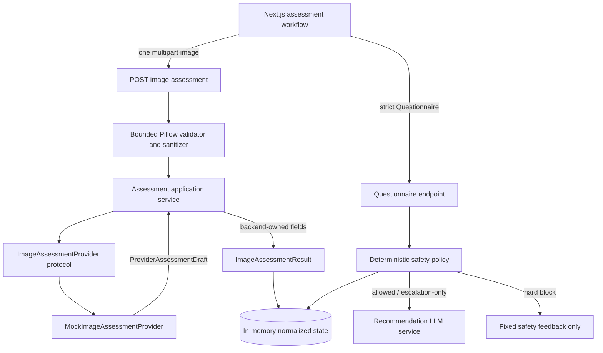

# F001A — Guarded Assessment Foundation

**Implementation status:** complete using the mock image-assessment provider<br>
**Implemented:** 2026-07-29<br>
**F001C provider status:** Cortex implementation available but disabled by default

## 1. Implemented Architecture

F001A replaces the fake two-request upload/classify workflow with a guarded, provider-neutral assessment pipeline:



The provider boundary is `backend/app/application/assessment/ports.py`. A future multimodal LLM or trained classifier implements `ImageAssessmentProvider` and returns `ProviderAssessmentDraft`; it cannot control engine identity, timestamps, prompt version, limitations, urgency, red flags, recommendation permission, or final safety.

## 2. Domain Contracts

The authoritative condition registry is `backend/app/domain/assessment/conditions.py`:

- `eczema`
- `fungal_infection`
- `scabies`
- `impetigo`
- `acne`
- `psoriasis`
- `folliculitis`
- `other_or_uncertain`

Unknown provider labels and legacy unsupported labels normalize to `other_or_uncertain`. Their numeric score is removed, confidence becomes low/unknown, more information is required, and condition-specific recommendation is blocked.

`backend/app/domain/assessment/models.py` defines:

- `ConfidenceLevel`
- `ImageQualityStatus` and `ImageQualityIssue`
- `AssessmentEngine`
- controlled `VisualFinding` and `VisualSafetySignal` enums
- `ProviderAssessmentDraft`
- backend-owned `ImageAssessmentResult`
- in-request-only `ValidatedImage`

All Pydantic boundary models forbid extra fields. Lists and strings are bounded, enum values are validated, and cross-field validators prevent contradictory quality/result states. Assessment providers have no unrestricted narrative field.

`backend/app/domain/questionnaire/models.py` defines explicit `yes | no | unsure` safety answers, pain `0..10`, bounded list inputs, enum duration/body-area/age fields, and all required safety questions. Missing values are rejected rather than interpreted as “no.”

## 3. Route Contracts and State Transitions

### Active routes

| Route | Purpose |
|---|---|
| `POST /v1/assessments` | Create a `draft` assessment |
| `POST /v1/assessments/{id}/image-assessment` | Validate, sanitize, assess, discard bytes, and return `ImageAssessmentResult` |
| `PUT /v1/assessments/{id}/questionnaire` | Validate answers, run safety, and return `SafetyResult` |
| `POST /v1/assessments/{id}/recommendation` | Generate safety-shaped guidance unless permission is `blocked` |
| `GET /v1/assessments/{id}` | Return normalized workflow state |
| `POST /v1/referrals` | Preserve the existing prototype referral path |

### Deprecated routes

- `POST /v1/assessments/{id}/image`
- `POST /v1/assessments/{id}/classify`

Both return `409 ASSESSMENT_STATE_CONFLICT` directing clients to the one-request route. Neither stores bytes or performs a second implementation.

### State machine

```text
draft
  -> image-assessment
     -> assessment_completed
        -> questionnaire
           -> questionnaire_completed (routine / recommendation allowed)
           -> professional_review_required (allowed or blocked by cause)
           -> urgent (explanation and escalation only)
           -> emergency (explanation and escalation only)
     -> retake_required
        -> image-assessment (replacement image)

questionnaire_completed
  -> recommendation
     -> completed
```

Questionnaire submission before an acceptable assessment and recommendation before assessment/questionnaire/safety return `ASSESSMENT_STATE_CONFLICT`. Completed recommendation calls are idempotent and return the stored result rather than calling the LLM again.

## 4. Stable Error Envelope

All application, request-validation, HTTP, and unexpected backend errors use:

```json
{
  "error": {
    "code": "IMAGE_DECODE_FAILED",
    "message": "The uploaded image could not be decoded.",
    "retryable": false,
    "details": {},
    "request_id": "opaque-request-id"
  }
}
```

Implemented codes include:

- `INVALID_IMAGE_TYPE`
- `IMAGE_TOO_LARGE`
- `IMAGE_DECODE_FAILED`
- `IMAGE_QUALITY_INSUFFICIENT`
- `ASSESSMENT_PROVIDER_UNAVAILABLE`
- `ASSESSMENT_TIMEOUT`
- `ASSESSMENT_OUTPUT_INVALID`
- `RECOMMENDATION_BLOCKED`
- `ASSESSMENT_NOT_FOUND`
- `ASSESSMENT_STATE_CONFLICT`
- `VALIDATION_ERROR`
- `INTERNAL_ERROR`
- `RECOMMENDATION_UNAVAILABLE`

Responses never include raw provider output, prompts, image bytes, filenames, provider URLs, secrets, or stack traces.

## 5. Image Lifecycle

1. The browser validates JPEG/PNG/WebP and 8 MiB for early feedback, creates a local preview object URL, and revokes it on replacement/unmount.
2. The browser sends one multipart `image` directly to `/image-assessment`.
3. FastAPI reads in bounded chunks with a configurable 8 MiB default.
4. Pillow performs actual decoding; only decoded JPEG, PNG, and WebP are accepted, and declared MIME must match decoded format.
5. The validator rejects corrupt files, images over 20 million decoded pixels, and images with a side below 320 pixels.
6. EXIF orientation is applied. The image is converted to RGB and re-encoded without EXIF, comments, GPS, or other metadata.
7. Only `ValidatedImage` containing sanitized bytes and verified metadata reaches the provider.
8. The application validates/normalizes the provider draft and persists only `ImageAssessmentResult`.
9. `UploadFile`, decoder objects, temporary buffers, and mutable original bytes are closed/cleared in `finally`.
10. `InMemoryAssessmentRepository` has no raw or sanitized image dictionary or save/get image method.

The production mock does not capture provider inputs. Test instances may opt into capture to assert sanitization.

## 6. Deterministic Safety Precedence

`backend/app/domain/safety/policy.py` evaluates:

1. **Emergency:** breathing difficulty; lip/tongue/throat swelling.
2. **Urgent:** rapid spread, high fever, configured severe pain threshold, eye involvement, extensive blistering, possible infection, significant bleeding, open wound, or corresponding controlled visual safety signals.
3. **Professional review:** uncertain/unsupported condition, low/unknown confidence, retake quality, relevant “unsure” safety answer, fever/swelling requiring review, infant/unsupported scope. Persistent or recurrent concern is retained as context but is not a review trigger by itself.
4. **Routine:** no higher rule.

Emergency and urgent results contain fixed backend-owned action messages and
`escalation_only`; routine is `allowed`. Professional review is `allowed` for
advisory causes such as low confidence or an `unsure` response, but `blocked`
for hard assessment problems such as an uncertain/unsupported condition or a
required image retake. The provider and recommendation LLM cannot override
this result.

Non-routine results also include deterministic `SafetyFeedback`: ordered
trigger explanations, fixed safest-next-step actions, a guidance-limitation
reason, and a structured clinician-ready summary of the preliminary condition
and reported questionnaire information. This feedback is backend-owned. When
permission is not blocked, it is presented before the separately generated,
safety-constrained recommendation context.

## 7. Recommendation Integration

`RecommendationInput` contains only:

- normalized condition/confidence/engine context;
- controlled visual findings, alternative conditions, and whether more
  information is needed;
- strict questionnaire;
- backend `SafetyResult`;
- backend-selected allowed guidance level;
- non-image skin context.

It forbids extra fields, so bytes, base64, paths, URLs, filenames, EXIF, and raw provider responses cannot enter the recommendation service.

The service checks safety before building a prompt or calling `LLMClient`:

- hard-blocked professional review raises `RECOMMENDATION_BLOCKED`;
- advisory professional review calls the provider, then constrains the output
  to review-first cautious guidance;
- urgent/emergency calls the provider for explanatory context, then forces an
  urgent-referral action and removes all routine steps;
- routine can include condition-specific product categories and a simple
  morning/evening educational routine.

No live image provider was added, and the recommendation component remains image-blind.

## 8. Frontend Workflow

The existing Next.js reducer workflow was migrated rather than rebuilt:

```text
create -> select/preview -> image-assessment
  -> retake guidance
  OR preliminary qualitative result -> structured questionnaire
     -> hard-blocked safety feedback
     OR safety feedback + constrained recommendation
     OR routine educational recommendation
```

The UI:

- says “Preliminary assessment,” never “Condition detected”;
- displays qualitative confidence only;
- maps controlled image-quality issues to retake instructions;
- shows emergency/urgent safety content before condition content;
- renders deterministic safety feedback before any non-routine AI context;
- does not render routine/product sections for urgent or emergency results;
- requires explicit questionnaire answers and includes a clearly labeled
  synthetic demo-answer shortcut for presentations;
- stores only the assessment ID in session storage, never image data;
- uses the shared backend error envelope through `ApiClientError`.

## 9. Test Coverage

Backend tests use generated solid-color images only; no patient or dermatology images are committed. Coverage includes:

- valid JPEG, PNG, and WebP;
- unsupported format and MIME/decoded mismatch;
- oversized bytes and excessive decoded pixels;
- corrupt and low-resolution images;
- EXIF application/removal;
- upload closure after success, timeout, and invalid output;
- retake, unknown-condition, low-confidence, timeout, unavailable, and malformed mock scenarios;
- provider replacement contract;
- exact condition registry and strict/cross-field validation;
- all emergency and urgent rules plus professional/routine branches;
- recommendation LLM not called for hard-blocked states;
- professional-review and escalation-only outputs constrained after generation;
- image vectors rejected from recommendation input;
- stable API error envelopes and invalid transitions;
- complete routine mock assessment-to-recommendation flow;
- existing allowed recommendation parsing/retry/idempotency behavior.

The execution environment cannot terminate worker-thread pools reliably, so API tests use HTTPX2's direct async ASGI transport and async dependency providers instead of thread-backed `TestClient`. This does not change the HTTP routes or runtime behavior.

## 10. Configuration

New settings:

```text
IMAGE_ASSESSMENT_PROVIDER=mock
IMAGE_ASSESSMENT_PROMPT_VERSION=image-assessment-v1
IMAGE_ASSESSMENT_TIMEOUT_SECONDS=20
IMAGE_ASSESSMENT_MAX_BYTES=8388608
IMAGE_ASSESSMENT_MAX_PIXELS=20000000
IMAGE_ASSESSMENT_MIN_SIDE=320
IMAGE_ASSESSMENT_MAX_IMAGES=1
SAFETY_POLICY_VERSION=v2
SEVERE_PAIN_THRESHOLD=7
```

Pillow 12.3.0 is the only image-processing dependency. HTTPX2 is a test-client dependency required by the current Starlette release. No computer-vision framework or live image-provider SDK was added.

## 11. Known Limitations

- The mock returns deterministic prototype output and performs no inference.
- There is no clinical evaluation, confidence calibration, or approved assessment prompt.
- One image only; no multi-angle/multi-image assessment.
- Metadata/results remain an unauthenticated, process-local in-memory prototype with no TTL.
- No production rate limiting, persistence, observability redaction validation, deployment configuration, or provider privacy review.
- Frontend has no established automated component-test framework; F001A does not add one solely for this change.
- The browser MIME/size checks are usability only; server decoding remains authoritative.
- The controlled visual-finding vocabulary is intentionally small and must be clinically reviewed before live use.

## 12. Exact Next Task — Live Multimodal Provider

Implement **F001C — Guarded Multimodal Assessment Provider** without changing the API, recommendation input, safety engine, repository result model, or frontend contract:

1. obtain provider privacy/retention/region approval and provision a separate server-side secret;
2. write and clinically review `image-assessment-v1` instructions and the generated `ProviderAssessmentDraft` JSON schema;
3. implement `MultimodalLLMAssessmentProvider` behind `ImageAssessmentProvider`;
4. send only sanitized inline image bytes, with a pinned server-side model alias and deadline;
5. enforce provider-native schema mode where available;
6. map transport timeout/unavailable/invalid output to the existing typed exceptions;
7. add payload, redaction, timeout, malformed-output, retry, and provider contract tests;
8. keep `IMAGE_ASSESSMENT_PROVIDER=mock` as the default until governed evaluation and clinical safety acceptance are complete.
