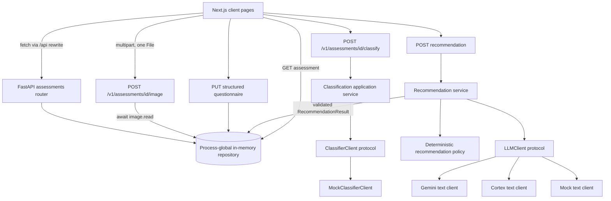
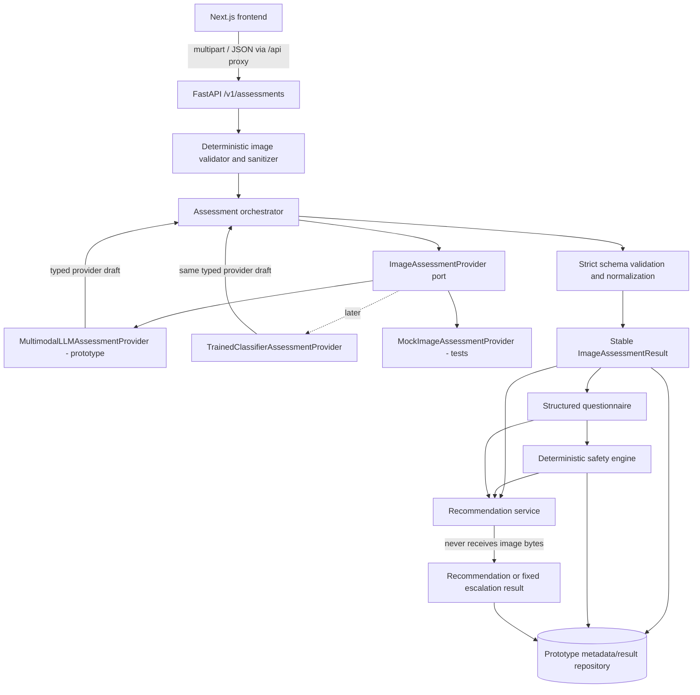

# F001 — Guarded LLM Image Assessment Integration Audit

**Status:** F001A foundation and F001C Cortex provider implemented; Cortex remains disabled by default

**Repository revision audited:** `4ff556c` (`main`)

**Audit date:** 2026-07-29

**Scope:** the complete tracked repository, excluding generated dependency/build directories

Evidence is cited as `path:line` or `path:line-line`. Statements labelled **Current fact** describe verified code. Statements labelled **Recommendation** describe proposed work.

## Implementation Status — F001A Guarded Assessment Foundation

**Implemented on 2026-07-29.** The repository now contains the guarded foundation proposed by this audit:

- strict assessment, questionnaire, and safety domain contracts;
- the authoritative eight-condition registry with unknown-condition fallback;
- a replaceable application-layer `ImageAssessmentProvider`;
- `MockImageAssessmentProvider` only—no live image provider is connected;
- bounded JPEG/PNG/WebP decoding and metadata-free sanitization with Pillow;
- one-request `POST /v1/assessments/{assessment_id}/image-assessment`;
- normalized assessment/safety persistence with no repository image-byte store;
- deterministic emergency, urgent, professional-review, and routine precedence;
- recommendation LLM short-circuiting for blocked and escalation states;
- frontend preliminary-assessment, retake, structured-questionnaire, and safety-first result flows;
- synthetic-image, provider, safety, error, lifecycle, and recommendation regression tests.

The old separate image-upload and classify routes remain only as deprecated conflict responses and have no second assessment implementation. F001A does not provide clinical validation, a live multimodal provider, persistent storage, authentication, multi-image support, or production deployment controls. See `docs/F001A_GUARDED_ASSESSMENT_FOUNDATION.md` for the implemented contracts and follow-up boundary.

## Implementation Status — F001C Cortex Provider

**Implemented on 2026-07-29.** `CortexMultimodalAssessmentProvider` now implements the existing `ImageAssessmentProvider` port using Cortex's Gemini-compatible `generateContent` endpoint, separate text and `inlineData` parts, `x-api-key`, JSON response mode, a schema derived from the protected provider-draft contract, strict response parsing, and one bounded retry for transient failures. The provider receives only the F001A-sanitized in-request image and is selected with `IMAGE_ASSESSMENT_PROVIDER=cortex`; `mock` remains the default. No public route, frontend, final assessment, safety, recommendation, repository, or image-lifecycle contract changed. Live use remains subject to provider privacy/retention/region approval and governed clinical evaluation. See `docs/F001C_CORTEX_MULTIMODAL_ASSESSMENT_PROVIDER.md`.

## 1. Executive Summary

SkinSense Africa is already a small web-first assessment prototype with a useful architectural starting point:

- a Next.js App Router frontend, declared as Next.js `^15.0.0`/React `^19.0.0` and locked to Next.js 15.5.22/React 19.2.8 (`frontend/package.json:5-25`, `frontend/package-lock.json:4528-4553`, `frontend/package-lock.json:5186-5204`);
- a FastAPI 0.140.0 backend with Pydantic settings, multipart support, and pytest (`backend/requirements.txt:1-5`);
- a multi-step browser workflow for assessment creation, one-image upload, classification, questionnaire submission, recommendation generation, and result display (`frontend/src/features/assessment/api.ts:12-42`);
- layered backend packages for API orchestration, application services, domain recommendation policy/models, and infrastructure clients;
- a provider-agnostic `ClassifierClient` protocol with a mock implementation (`backend/app/infrastructure/classifier/client.py:16-34`);
- a separate, text-only recommendation LLM abstraction with Gemini, Cortex, and mock implementations (`backend/app/infrastructure/llm/client.py:55-63`, `backend/app/infrastructure/llm/client.py:169-235`);
- deterministic confidence/red-flag policy and backend-owned recommendation fields (`backend/app/domain/recommendation/policy.py:50-61`, `backend/app/application/recommendation/service.py:118-138`).

However, the current application does **not** perform image analysis. Its only classifier is `MockClassifierClient`, which ignores both the bytes and content type and always returns acne with confidence 0.85 (`backend/app/infrastructure/classifier/client.py:23-34`). The real LLM clients accept text messages only, and the recommendation prompt explicitly says not to inspect an image (`backend/app/infrastructure/llm/client.py:55-59`, `backend/app/domain/recommendation/prompt_builder.py:11-12`). There is no multimodal request construction.

The cleanest integration is **Option C: a backend image-assessment provider abstraction plus separate image validation, assessment orchestration, deterministic safety, and recommendation services**. This extends the layering already present rather than coupling routes or frontend code to Gemini/Cortex. The stable internal contract should be an `ImageAssessmentResult`, replacing the overly narrow `ClassificationResult` at the application boundary. A multimodal LLM provider and a future trained-classifier provider should both produce a provider draft that the orchestrator normalizes into that backend-owned result.

The existing target contract is directionally suitable, but should change in four important ways:

1. use `condition`, not `predicted_condition`, and make the allow-list an enum;
2. separate `confidence_level` from optional `confidence_score`, because LLM self-reported numeric confidence must not be presented as calibrated probability;
3. model image quality as a disposition plus typed issues, rather than mixing `unsupported_file` with model-observed quality;
4. reserve final `red_flags`, `urgency`, and `recommendation_status` for backend policy after structured symptoms are collected.

Major blockers before a real provider can be enabled are:

- server upload validation trusts `Content-Type: image/*`, reads the whole body without a size bound, and does not decode or sanitize it (`backend/app/api/routers/assessments.py:81-94`);
- images are retained in a process-global dictionary with no delete/expiry path (`backend/app/api/repository.py:32-60`);
- emergency questions for breathing difficulty and lip/tongue/throat swelling do not exist;
- current policy incorrectly labels bleeding/open wound and eye involvement as “emergency,” while the requested taxonomy makes these urgent; it also lacks blistering, possible infection, persistence/recurrent state, and unsupported-condition handling (`backend/app/domain/recommendation/policy.py:16-47`);
- most API errors use FastAPI's `{"detail": ...}` response, while the frontend only extracts the custom `{"error": ...}` shape (`backend/app/api/routers/assessments.py:87-112`, `frontend/src/lib/api-client.ts:28-52`);
- there is no rate limiting, production storage, authentication/access control, deployment manifest, image decoder, image-processing dependency, or frontend test framework.

**Implementation can begin safely only with contracts, deterministic validation, lifecycle cleanup, mock-provider tests, and safety policy first.** A live multimodal provider should not be enabled until those phases pass and provider privacy/retention terms, model selection, and clinical review of policy/copy are resolved.

## 2. Current System Architecture

### 2.1 Frontend

**Current fact.** The frontend uses the Next.js App Router. All three pages are client components:

- `/` creates an assessment and stores its ID in `sessionStorage` (`frontend/src/app/page.tsx:1-25`);
- `/assessment/[id]` owns the upload/classify/questionnaire/recommendation sequence (`frontend/src/app/assessment/[id]/page.tsx:18-94`);
- `/result/[id]` fetches the stored assessment and renders its recommendation (`frontend/src/app/result/[id]/page.tsx:10-16`).

State is local `useReducer` state; no form, query, or schema-validation library is installed (`frontend/src/features/assessment/useAssessment.ts:1-157`, `frontend/package.json:11-25`). The browser uses native `fetch` through one wrapper (`frontend/src/lib/api-client.ts:55-106`). In development, `/api/*` is rewritten to FastAPI at `127.0.0.1:8000/*` (`frontend/next.config.mjs:4-10`).

### 2.2 Backend

**Current fact.** `app.main` creates one FastAPI application, installs CORS for the two localhost frontend origins, allows credentials and all methods/headers, and includes one router (`backend/app/main.py:3-17`). The router exposes:

1. `POST /v1/assessments`;
2. `POST /v1/assessments/{id}/image`;
3. `POST /v1/assessments/{id}/classify`;
4. `PUT /v1/assessments/{id}/questionnaire`;
5. `POST /v1/assessments/{id}/recommendation`;
6. `GET /v1/assessments/{id}`;
7. `POST /v1/referrals`.

Dependencies create process-global in-memory assessment and referral repositories and select classifier/LLM clients from settings (`backend/app/api/dependencies.py:12-29`). The recommendation application service calls deterministic policy, builds a prompt, calls a text LLM, validates its JSON, enforces referral-safe actions, and adds backend-owned fields (`backend/app/application/recommendation/service.py:141-172`).

### 2.3 API, storage, AI, deployment, and testing

**Current fact.**

- The API and TypeScript contracts are hand-maintained separately; there is no OpenAPI-generated client.
- Assessment records, raw image bytes, recommendation results, and referral contact details are all process memory only (`backend/app/api/repository.py:21-123`).
- The classifier is a mock only. Gemini and Cortex are wired only for text recommendation generation.
- Configuration is loaded from environment or `backend/.env` via `pydantic-settings` (`backend/app/settings.py:9-50`).
- There are no Dockerfiles, Cloud Run/Vercel/Firebase/Supabase manifests, CI workflows, database migrations, cloud-storage adapters, or deployment documentation in the repository.
- Backend tests use pytest and FastAPI `TestClient`; test discovery is configured under `backend/tests` (`backend/pytest.ini:1-5`). No frontend test script, runner, or test files exist (`frontend/package.json:5-25`).

### 2.4 Current flow diagram



## 3. Relevant Existing Files

| File | Current responsibility and relevant symbols | Relevance | Recommended action | Risk |
|---|---|---|---|---|
| `backend/app/main.py` | FastAPI creation and fixed localhost CORS (`app`) | Entry point for exception handlers and configured CORS | Add shared error handlers; source CORS origins from settings | Medium |
| `backend/app/settings.py` | Typed LLM/classifier/confidence settings (`Settings`) | Natural home for provider, image, timeout, and lifecycle settings | Extend with assessment-specific settings; validate ranges/allow-lists | Medium |
| `backend/app/api/dependencies.py` | Process singletons and provider factories | Composition root for provider injection | Add assessment provider, validator, safety, and orchestrator dependencies | Medium |
| `backend/app/api/repository.py` | In-memory workflow and image byte stores | Current lifecycle persistence | Retain prototype metadata store, remove raw-image retention after assessment, add safety/result fields and explicit expiry/delete | Critical |
| `backend/app/api/routers/assessments.py` | All workflow endpoints and inline API models | Current upload/classify/recommendation surface | Keep route convention, replace `/classify` implementation with provider-backed image assessment, use shared errors | High |
| `backend/app/application/classification/service.py` | Thin forwarding function | Seed for assessment orchestration | Replace with an `application/assessment` service; do not add provider logic here | High |
| `backend/app/infrastructure/classifier/client.py` | `ClassifierClient`, mock, factory | Existing replacement boundary but result is too narrow | Migrate to `ImageAssessmentProvider`; keep an adapter/deprecation path during rollout | High |
| `backend/app/domain/recommendation/models.py` | Conditions, questionnaire, recommendation models | Contains contracts that assessment and safety will share | Split assessment/questionnaire types out; preserve imports temporarily; strengthen validation | High |
| `backend/app/domain/recommendation/policy.py` | Confidence and red-flag branching | Existing deterministic safety seed | Separate clinical urgency from guidance policy; correct taxonomy and precedence | Critical |
| `backend/app/domain/recommendation/prompt_builder.py` | Versioned text recommendation prompt | Demonstrates controlled prompt construction | Keep recommendation image-blind; do not reuse this prompt for assessment | High |
| `backend/app/application/recommendation/service.py` | Retry, parse, enforce, assemble | Good separation after assessment | Change input to stable assessment + symptoms + safety; bypass free-form LLM for blocked escalation states | High |
| `backend/app/infrastructure/llm/client.py` | Gemini/Cortex/mock text transports | Useful transport patterns, but recommendation-specific and partially schema-enforced | Do not pass images through `LLMClient`; add a distinct multimodal provider and optionally extract shared HTTP transport later | High |
| `backend/.env.example` | LLM and threshold placeholders | Documents server secrets/config | Add non-secret assessment configuration names only | Medium |
| `backend/requirements.txt` | Runtime/test dependencies | Lacks image decoding/processing and async test declarations | Add a pinned decoder only during implementation; evaluate SDK vs current HTTP transport | Medium |
| `backend/tests/api/test_assessment_workflow_endpoints.py` | Current workflow endpoint coverage | Best location for upload/workflow integration cases | Replace pretend bytes with fixtures and add error/lifecycle assertions | High |
| `backend/tests/domain/recommendation/test_policy.py` | Existing safety precedence tests | Direct migration target | Split/add `tests/domain/safety/test_policy.py` | Critical |
| `backend/tests/application/recommendation/test_service.py` | Parse/retry/override tests | Proves backend-owned fields | Add image-exclusion and blocked-recommendation tests | High |
| `backend/tests/infrastructure/llm/test_client.py` | Text client and timeout tests | Provider failure precedent | Keep for recommendation; add separate assessment-provider tests | Medium |
| `frontend/src/components/ImageUploader.tsx` | Single image/camera chooser | Existing upload UI | Reuse; add consent, server-error mapping, quality guidance, and optional future multi-image affordance | Medium |
| `frontend/src/features/assessment/validation.ts` | MIME and 12 MB browser checks | Advisory validation only | Keep as early feedback; align constants with server contract, never treat as security | High |
| `frontend/src/features/assessment/api.ts` | Multipart and workflow calls | Current API boundary | Add typed `assessImage`; preserve separate recommendation call | Medium |
| `frontend/src/features/assessment/types.ts` | Handwritten API/domain types | Must reflect stable contract | Add generated/shared-equivalent assessment, quality, safety, error types | High |
| `frontend/src/features/assessment/useAssessment.ts` | Client workflow reducer | Supports required phases already | Add retake, quality-rejected, safety-escalated, and resume/hydrate transitions | Medium |
| `frontend/src/app/assessment/[id]/page.tsx` | Orchestrates all client steps | Current direct sequential workflow | Replace “classify” display with preliminary assessment/quality states; never show uncalibrated percentage | High |
| `frontend/src/components/QuestionnaireStep.tsx` | Native React structured questionnaire | Can support V1 without a new form library | Add missing safety questions, bounded inputs, explicit unknowns, and required red-flag answers | Critical |
| `frontend/src/components/RecommendationResult.tsx` | Recommendation and referral UI | Existing safe-copy foundation | Render urgency before condition; distinguish uncertainty/retake; remove diagnostic phrasing/LLM percentage | Critical |
| `frontend/src/lib/api-client.ts` | Custom error parser | Already understands desired nested error shape | Preserve and formalize it across every backend error | Medium |
| `frontend/next.config.mjs` | Development API rewrite | Not production-deployable as written | Configure production backend destination or deployment routing | High |

## 4. Existing Image Capabilities

### Implemented

**Current fact.**

- The UI accepts one file from storage or the environment-facing mobile camera (`frontend/src/components/ImageUploader.tsx:45-67`).
- Browser validation allows JPEG, PNG, and WebP MIME values up to 12 MiB (`frontend/src/lib/constants.ts:7-10`, `frontend/src/features/assessment/validation.ts:3-12`).
- Preview uses a local object URL, not base64 or cloud storage; URLs are revoked on replace/unmount (`frontend/src/app/assessment/[id]/page.tsx:30`, `frontend/src/app/assessment/[id]/page.tsx:46-55`).
- Transport is one `multipart/form-data` part named `image` (`frontend/src/features/assessment/api.ts:16-23`).
- FastAPI receives `UploadFile`, checks only that the client-supplied content type starts with `image/`, and then reads all bytes into memory (`backend/app/api/routers/assessments.py:81-94`).
- The repository stores `(bytes, content_type)` in `_images`, separately from the returned `AssessmentRecord` (`backend/app/api/repository.py:32-60`).

### Missing or unsafe

**Current fact.**

- No server-side allow-list matches the frontend's three formats.
- No server-side maximum size, streaming byte limit, decoded pixel limit, magic-byte check, image decode, dimension check, blur/lighting/suitability check, EXIF orientation handling, or metadata stripping exists.
- A file named as `image/*` can contain arbitrary/corrupt bytes; the existing tests deliberately use `b"pretend image"` and treat it as valid (`backend/tests/api/test_assessment_workflow_endpoints.py:26-32`).
- `await image.read()` makes an unbounded bytes allocation. Although `UploadFile` may spool multipart input internally, the application then copies the complete file into memory.
- Raw images remain in `_images` until process exit. There is no delete, expiry, cancellation cleanup, post-classification cleanup, or memory bound.
- Only one image is supported. There is no multi-angle grouping or unrelated-image detection.
- No image bytes are written intentionally by application code, uploaded to storage, converted to base64, or passed via a signed URL. The future provider will change the provider-transfer part of this statement.

**Recommendation.** V1 should retain the one-image UI and API because that is the actual working flow. Design the internal request as `tuple[ValidatedImage, ...]` with `max_images=1` so a later two-image flow is additive. Do not claim multi-image support in the first implementation.

## 5. Existing LLM and Multimodal Capabilities

### Providers and clients

**Current fact.**

- `LLMClient.generate(messages) -> str` is a text-only protocol (`backend/app/infrastructure/llm/client.py:55-59`).
- `GeminiRecommendationClient` calls Google's `generateContent` REST endpoint using `urllib`; its payload contains text parts only and requests JSON MIME type, but not a response schema (`backend/app/infrastructure/llm/client.py:97-145`).
- `CortexRecommendationClient` calls a Gemini-compatible endpoint with text parts, temperature 0, JSON MIME type, and `RECOMMENDATION_DRAFT_SCHEMA` (`backend/app/infrastructure/llm/client.py:203-232`).
- `MockLLMClient` supports deterministic recommendation tests (`backend/app/infrastructure/llm/client.py:235-263`).
- `get_llm_client` chooses `mock`, `cortex`, or Gemini (including blank provider) from settings (`backend/app/infrastructure/llm/client.py:273-307`).
- No OpenAI client or SDK is present. No image part, `inlineData`, base64 image, upload API, or image URL is constructed anywhere.

### Prompting and structured output

**Current fact.**

- Recommendation prompt content is hardcoded as `SYSTEM_PROMPT_V1`; it prohibits diagnosis, prescribing, dosage, invented history, and overriding permitted guidance (`backend/app/domain/recommendation/prompt_builder.py:11-12`).
- The prompt receives condition, permitted guidance, skin context, and provided questionnaire values, but not confidence, assessment ID, model version, or image (`backend/app/domain/recommendation/prompt_builder.py:53-98`; verified by `backend/tests/domain/recommendation/test_prompt_builder.py:61-83`).
- The service parses JSON and validates `RecommendationDraft` with Pydantic (`backend/app/application/recommendation/service.py:50-64`). It also tolerates single strings for selected list fields (`backend/app/application/recommendation/service.py:67-85`).
- Pydantic models use default extra-field behavior rather than explicit `extra="forbid"`, so “fields exactly” is not fully enforced. The tests rely on extra protected fields being ignored (`backend/tests/application/recommendation/test_service.py:85-106`).
- `recommendation_prompt_version` exists in settings and `.env.example`, but runtime responses use the separate hardcoded `PROMPT_VERSION = "v1"` (`backend/app/settings.py:18`, `backend/.env.example:7`, `backend/app/domain/recommendation/prompt_builder.py:11`, `backend/app/application/recommendation/service.py:134`).

### Timeouts, retries, errors, and logging

**Current fact.**

- Both real clients pass a configurable HTTP timeout to `urlopen` and translate timeout/network/provider-envelope failures into `RecommendationLLMError` (`backend/app/infrastructure/llm/client.py:75-95`, `backend/app/infrastructure/llm/client.py:185-201`).
- The application retries exactly once, immediately, for provider or validation failures; there is no backoff, jitter, circuit breaker, cancellation budget, or provider-specific retry classification (`backend/app/application/recommendation/service.py:145-163`).
- The “repair” policy only normalizes a few string-to-list mistakes. It does not issue a constrained repair request.
- Provider HTTP error body text, truncated to 300 characters, is placed into exception messages (`backend/app/infrastructure/llm/client.py:87-89`, `backend/app/infrastructure/llm/client.py:160-166`), and the application logs exception text (`backend/app/application/recommendation/service.py:156-161`). A provider response could therefore place sensitive or unsafe text in logs.
- The Gemini API key is included in the request URL (`backend/app/infrastructure/llm/client.py:134-143`), which increases exposure risk in URL-level observability even though it is never sent to the frontend.

### Abstraction assessment

The current `ClassifierClient` is the right conceptual seam but its `ClassificationResult` cannot carry visual findings, alternatives, image quality, information needs, limitations, or engine type. Extending this result in place would also keep the provider port in `infrastructure`, forcing application code to import outward. Create the stronger assessment port in the application layer, then adapt/deprecate `ClassifierClient`.

## 6. Integration Options Considered

### Option A — Frontend calls the multimodal provider directly

**Reject.** It would expose provider credentials or require a new client-token broker, send sensitive images outside backend validation, bypass deterministic safety and schema enforcement, make provider replacement a frontend change, and conflict with the existing backend-only LLM design. It also undermines the `/api` wrapper and current backend workflow.

### Option B — FastAPI route calls one multimodal provider directly

**Not recommended.** This protects the API key and allows upload checks, but would couple `assessments.py` to a provider request/response, repeat the current router's already broad responsibilities, and make the later trained classifier a route rewrite. Provider output could leak to the frontend before domain normalization.

### Option C — Backend provider abstraction with assessment, safety, and recommendation services

**Recommend.** It fits the repository's current API/application/domain/infrastructure layers. The route invokes an assessment application service; the service receives a validated/sanitized image and an `ImageAssessmentProvider`; the provider returns a strictly validated draft; the service owns condition fallback, quality disposition, limitations, and engine metadata. Questionnaire submission runs deterministic safety. Recommendation consumes only stable assessment + questionnaire + safety.

Trade-off: Option C adds more small modules and mapping code than Option B. That cost is justified here because provider replacement is an explicit requirement and because medical-safety fields must not be provider-owned.

## 7. Recommended Target Architecture



The solid `ImageAssessmentProvider` port is the replacement boundary. Neither routes, safety rules, recommendation code, storage, nor frontend types should reference Gemini, Cortex, OpenAI, an image model name, or classifier-specific tensors.

The orchestrator, not the provider, owns:

- fallback of unknown labels to `other_or_uncertain`;
- final quality disposition;
- final limitations;
- engine identity copied from trusted configuration;
- follow-up question allow-listing;
- recommendation eligibility before/after safety;
- timestamps and latency;
- red flags and urgency.

## 8. Proposed Backend Structure

Use the repository's existing layered convention rather than introducing generic `services/` and `providers/` roots.

```text
backend/app/
├── api/
│   ├── errors.py                              # new
│   ├── schemas/
│   │   └── assessments.py                    # new
│   ├── dependencies.py                       # modify
│   ├── repository.py                         # modify
│   └── routers/assessments.py                # modify
├── application/
│   ├── assessment/
│   │   ├── __init__.py                       # new
│   │   ├── ports.py                          # new
│   │   ├── prompt_builder.py                 # new
│   │   └── service.py                        # new
│   ├── classification/service.py             # deprecate/adapter, then remove
│   └── recommendation/service.py             # modify
├── domain/
│   ├── assessment/
│   │   ├── __init__.py                       # new
│   │   ├── conditions.py                     # new
│   │   └── models.py                         # new
│   ├── questionnaire/
│   │   ├── __init__.py                       # new
│   │   └── models.py                         # new
│   ├── safety/
│   │   ├── __init__.py                       # new
│   │   ├── models.py                         # new
│   │   └── policy.py                         # new
│   └── recommendation/                       # retain; narrow to recommendation
├── infrastructure/
│   ├── assessment/
│   │   ├── __init__.py                       # new
│   │   ├── multimodal_llm.py                 # new
│   │   ├── trained_classifier.py             # new stub only in F001H
│   │   └── mock.py                           # new
│   ├── image/
│   │   ├── __init__.py                       # new
│   │   └── validator.py                      # new
│   ├── classifier/client.py                  # retain adapter during migration
│   └── llm/client.py                         # retain recommendation-only client
└── settings.py                               # modify
```

### Proposed file responsibilities

| Proposed file | Main classes/functions | Dependencies |
|---|---|---|
| `domain/assessment/conditions.py` | `Condition`, `SUPPORTED_CONDITIONS`, `normalize_condition()` | Python enum only; single allowed-condition registry |
| `domain/assessment/models.py` | assessment/quality/confidence/engine enums; `ProviderAssessmentDraft`; `ImageAssessmentResult`; `ValidatedImageMetadata` | Pydantic; condition registry |
| `domain/questionnaire/models.py` | bounded `Questionnaire`, `AgeGroup`, `DurationBand`, `BodyArea`, explicit safety answers | Pydantic only |
| `domain/safety/models.py` | `Urgency`, `RedFlag`, `SafetyResult`, `RecommendationPermission` | assessment/questionnaire domain types |
| `domain/safety/policy.py` | `evaluate_safety(assessment, questionnaire) -> SafetyResult` | No settings singleton and no provider imports; thresholds passed as policy config |
| `application/assessment/ports.py` | `ImageAssessmentProvider` protocol and provider exceptions | domain assessment models |
| `application/assessment/prompt_builder.py` | versioned, provider-neutral assessment instructions and schema description | condition registry/schema only |
| `application/assessment/service.py` | `assess_image()`, normalize/fallback, quality decision, protected fields, cleanup orchestration | port, validator output, domain models |
| `infrastructure/image/validator.py` | bounded read/decode, real MIME/format, pixel/dimension limits, EXIF transpose and metadata-free re-encode | pinned Pillow (proposed); settings |
| `infrastructure/assessment/multimodal_llm.py` | Gemini/Cortex image+text request, schema mode, envelope parsing, timeout mapping | assessment port, transport/config; no API imports |
| `infrastructure/assessment/mock.py` | deterministic provider, captured calls, malformed/timeout fixtures | assessment port |
| `infrastructure/assessment/trained_classifier.py` | later adapter mapping classifier probabilities/findings to the same draft | future model runtime only |
| `api/schemas/assessments.py` | HTTP request/response models distinct from stored/domain models | domain models |
| `api/errors.py` | `ErrorCode`, `ErrorResponse`, exception-to-status handlers, request ID | FastAPI/Pydantic |

`backend/app/domain/recommendation/models.py` currently holds `SupportedCondition` and `Questionnaire` (`:14-21`, `:44-59`). During F001A, re-export moved names temporarily so existing tests and recommendation imports can migrate incrementally.

Do not add a database, task queue, cloud image store, or authentication system in F001A–F001G. Those are separate architectural decisions and are not required to prove the guarded provider boundary.

## 9. Proposed Frontend Structure

### Reuse and modify

- Keep `ImageUploader`, native file/camera inputs, object-URL preview, and reducer-based workflow. These already provide the required mobile capture/replace pattern.
- Keep the separate `features/assessment/api.ts` boundary and `ApiClientError`.
- Keep the structured `QuestionnaireStep`; no unrestricted chat UI should be added.
- Keep `RecommendationResult` as a presentation component, but make safety status its first branch.

### Exact changes

| File | Recommendation |
|---|---|
| `frontend/src/features/assessment/types.ts` | Add types matching `ImageAssessmentResult`, quality, questions, `SafetyResult`, typed errors, and recommendation status. Replace `ClassificationResult` use after a compatibility period. |
| `frontend/src/features/assessment/api.ts` | Add `assessImage(id)` calling `POST /v1/assessments/{id}/image-assessment`; keep upload and recommendation separate. |
| `frontend/src/features/assessment/useAssessment.ts` | Add `validatingImage`, `retakeRequired`, `assessmentCompleted`, `safetyEscalated`; hydrate state from GET when a route is revisited. |
| `frontend/src/components/ImageUploader.tsx` | Add explicit consent before selection, explain one concern/one image, retain format/size feedback, and surface server codes verbatim through mapped copy. |
| `frontend/src/app/assessment/[id]/page.tsx` | Replace `classifyAssessment`; render quality issues/retake before questionnaire; say “preliminary assessment,” not “Condition detected”; show a level, not an LLM percentage. |
| `frontend/src/components/QuestionnaireStep.tsx` | Add breathing difficulty; lip/tongue/throat swelling; high fever; blistering; bleeding and open wound separately; possible infection cues; age group; recurrence. Make emergency/red-flag questions explicit yes/no/unsure rather than silently skippable. |
| `frontend/src/components/ProcessingState.tsx` | Reflect the real current stage. It currently says “Analyzing your image” while mounted only during recommendation generation (`assessment/[id]/page.tsx:102-104`). |
| `frontend/src/components/RecommendationResult.tsx` | Render emergency/urgent fixed escalation first; render uncertainty and retake without a condition headline; hide treatment-like sections when blocked. |
| `frontend/src/app/result/[id]/page.tsx` | Render stored safety result even when recommendation generation is intentionally blocked. |

### Loading, error, and retake behavior

- Selection/preview remains local; upload shows byte-transfer state; assessment shows provider state separately.
- `IMAGE_QUALITY_INSUFFICIENT` should return typed issues. Show specific capture help and reset the server image/result before replacement.
- `ASSESSMENT_TIMEOUT` and retryable provider errors may expose a retry button that reuses the already-sanitized image only if it still exists within the same request. Under the no-retention design, the normal retry is re-upload; do not falsely say “your image is saved.”
- Safety-critical answers should be reviewable before submission. “Unsure” is valid and may cause professional review; absence is not equivalent to `false`.
- The present error branch checks `INVALID_IMAGE`, a code the backend never emits (`frontend/src/app/assessment/[id]/page.tsx:67-71`). Replace with the standardized codes below.

## 10. API Contracts

### Route naming decision

Do **not** introduce `POST /api/v1/skin-assessments` in FastAPI. In this repository, `/api` is a frontend proxy prefix (`frontend/src/lib/constants.ts:4-5`, `frontend/next.config.mjs:7-9`) and the backend convention is `/v1/assessments`. “Skin” would be redundant in a SkinSense-only service and would split the existing resource.

Keep the current resource and separate workflow:

1. `POST /v1/assessments`
2. `POST /v1/assessments/{assessment_id}/image`
3. `POST /v1/assessments/{assessment_id}/image-assessment`
4. `PUT /v1/assessments/{assessment_id}/questionnaire`
5. `POST /v1/assessments/{assessment_id}/recommendation`
6. `GET /v1/assessments/{assessment_id}`

The browser reaches these as `/api/v1/...` only when `NEXT_PUBLIC_API_BASE_URL` is `/api`.

`POST /v1/assessments/{id}/classify` should be a temporary alias returning the new result during one frontend migration, then removed. Do not maintain two implementations.

### 10.1 Create

`POST /v1/assessments`

Request: empty body.

```json
{
  "id": "uuid",
  "status": "draft",
  "expires_at": "2026-07-29T12:30:00Z"
}
```

No authentication is proposed for V1, consistent with the brief and current application. IDs must remain high-entropy. This is not access control; do not persist identifiable data or images under an unauthenticated ID.

### 10.2 Upload

`POST /v1/assessments/{assessment_id}/image`

Request: multipart `image`, exactly one file.

Success:

```json
{
  "id": "uuid",
  "status": "image_validated",
  "image": {
    "format": "jpeg",
    "width": 1280,
    "height": 960
  }
}
```

Do not return filename, hash, EXIF, or provider representation. A stronger privacy variant combines upload and assessment in one request so raw bytes never live between calls. Given the existing multi-step API, the recommended implementation should in fact perform **validation + assessment within this upload request** and return the assessment result, or rename it to `POST .../image-assessment`.

Therefore, the preferred final contract is:

### 10.3 Preferred image assessment

`POST /v1/assessments/{assessment_id}/image-assessment`

Request: multipart `image`.

```json
{
  "assessment_status": "completed",
  "condition": "eczema",
  "confidence_level": "moderate",
  "confidence_score": null,
  "visual_findings": ["dry-appearing patch", "visible scaling"],
  "alternative_conditions": ["fungal_infection"],
  "image_quality": {
    "status": "acceptable",
    "issues": []
  },
  "needs_more_information": true,
  "follow_up_question_ids": ["itching", "duration", "rapidly_spreading"],
  "visual_safety_signals": [],
  "recommendation_status": "pending_questionnaire",
  "assessment_engine": "multimodal_llm_prototype",
  "engine_version": "server-owned-model-alias",
  "prompt_version": "image-assessment-v1",
  "limitations": [
    "This is a preliminary AI-assisted assessment.",
    "This is not a confirmed diagnosis."
  ]
}
```

This endpoint validates, sanitizes, invokes, stores only the result, and discards image bytes before responding. It supersedes separate upload plus classify calls and eliminates the current inter-request image retention. It is the safest form of “one orchestrated endpoint with separate internal services.”

If the client must show upload progress, it still can: upload and provider processing are phases of one request. If provider latency later requires asynchronous jobs, add `202` polling then; do not pre-emptively add a queue.

### 10.4 Questionnaire

`PUT /v1/assessments/{assessment_id}/questionnaire`

Request:

```json
{
  "duration": "one_to_four_weeks",
  "itching": "yes",
  "pain_level": 3,
  "rapidly_spreading": "no",
  "affected_body_area": "face_or_neck",
  "fever": "no",
  "high_fever": "no",
  "swelling": "no",
  "difficulty_breathing": "no",
  "lip_tongue_throat_swelling": "no",
  "bleeding": "no",
  "blistering": "no",
  "open_wound": "no",
  "eye_involvement": "no",
  "possible_infection": "no",
  "previous_treatment": [],
  "known_allergies": [],
  "current_products": [],
  "age_group": "adult",
  "recurrent": "no"
}
```

Use `yes | no | unsure`, not nullable booleans, for safety questions. Validate pain `0..10`, enum fields, list count, and string length. Reject unknown properties.

Response runs safety immediately:

```json
{
  "id": "uuid",
  "status": "questionnaire_completed",
  "safety": {
    "urgency": "routine",
    "red_flags": [],
    "recommendation_permission": "allowed",
    "reason_codes": []
  }
}
```

### 10.5 Recommendation

`POST /v1/assessments/{assessment_id}/recommendation`

Request: empty. The server loads assessment, questionnaire, and safety result by ID. Never accept a client-supplied condition, confidence, urgency, or image here.

Success retains the current top-level backend-owned fields but should add `status` and `safety`, and should rename the nested `draft` to `guidance` before the public contract stabilizes:

```json
{
  "assessment_id": "uuid",
  "status": "completed",
  "condition": "eczema",
  "confidence_level": "moderate",
  "safety": {
    "urgency": "routine",
    "red_flags": [],
    "recommendation_permission": "allowed"
  },
  "guidance_level": "cautious_guidance",
  "guidance": {},
  "disclaimer": "Backend-owned fixed text",
  "generated_at": "2026-07-29T12:00:00Z"
}
```

For emergency/urgent states, questionnaire submission stores a deterministic escalation result and the UI does not call recommendation generation. A defensive recommendation call returns `409 RED_FLAG_ESCALATION_REQUIRED`. For low confidence, retake-required quality, or unsupported/uncertain conditions, return `409 RECOMMENDATION_BLOCKED` with safe next-step details.

### 10.6 Error contract

Reuse the only existing structured convention (`backend/app/api/routers/assessments.py:57-64`) and the frontend parser (`frontend/src/lib/api-client.ts:28-47`) across all endpoints:

```json
{
  "error": {
    "code": "IMAGE_TOO_LARGE",
    "message": "The image exceeds the allowed size.",
    "retryable": false,
    "details": {
      "max_bytes": 8388608
    },
    "request_id": "opaque-id"
  }
}
```

| Code | HTTP | Retryable | Use |
|---|---:|---:|---|
| `INVALID_IMAGE_TYPE` | 415 | false | Declared or decoded format not allow-listed |
| `IMAGE_TOO_LARGE` | 413 | false | Stream exceeds byte or decoded-pixel bound |
| `IMAGE_DECODE_FAILED` | 422 | false | Corrupt, truncated, or unsupported encoding |
| `IMAGE_QUALITY_INSUFFICIENT` | 422 | true | Valid image needs retake; details contain typed issues |
| `ASSESSMENT_PROVIDER_UNAVAILABLE` | 503 | true | Provider/network unavailable after bounded retry |
| `ASSESSMENT_TIMEOUT` | 504 | true | Assessment deadline exceeded |
| `ASSESSMENT_OUTPUT_INVALID` | 502 | true | Provider envelope/schema invalid after one controlled retry |
| `UNSUPPORTED_CONDITION` | 422 | false | Only for explicit invalid consumer input; provider labels normally normalize to fallback |
| `RECOMMENDATION_BLOCKED` | 409 | false | Quality/confidence/uncertain state disallows generated guidance |
| `RED_FLAG_ESCALATION_REQUIRED` | 409 | false | Client attempted recommendation despite emergency/urgent safety result |
| `INTERNAL_ERROR` | 500 | true | Sanitized catch-all |

Also standardize `ASSESSMENT_NOT_FOUND` (404), `ASSESSMENT_STATE_CONFLICT` (409), `VALIDATION_ERROR` (422), and retain `RECOMMENDATION_UNAVAILABLE` (503). Never include provider bodies, raw prompts, image bytes/base64, filenames, contact details, stack traces, or secret-bearing URLs in `details`.

## 11. Internal Domain Models

### Condition registry

```python
class Condition(StrEnum):
    ECZEMA = "eczema"
    FUNGAL_INFECTION = "fungal_infection"
    SCABIES = "scabies"
    IMPETIGO = "impetigo"
    ACNE = "acne"
    PSORIASIS = "psoriasis"
    FOLLICULITIS = "folliculitis"
    OTHER_OR_UNCERTAIN = "other_or_uncertain"
```

Put the authoritative registry in `backend/app/domain/assessment/conditions.py`. Prompt building, provider response schema, backend normalization, recommendation policy, and API OpenAPI schemas must import from it. The frontend mirrors the API enum; do not maintain a second provider-specific allow-list.

Current labels do not align: `eczema_dermatitis`, `hyperpigmentation`, `possible_fungal_infection`, and `other_uncertain` appear in `SupportedCondition` (`backend/app/domain/recommendation/models.py:14-21`). Define an explicit migration map:

- `eczema_dermatitis -> eczema`
- `possible_fungal_infection -> fungal_infection`
- `other_uncertain -> other_or_uncertain`
- `hyperpigmentation -> other_or_uncertain` for this controlled set unless clinical/product owners deliberately add it

Never reject an unknown model string before normalization; map it to `OTHER_OR_UNCERTAIN`, set low/unknown confidence, block condition-specific recommendations, and emit a non-sensitive metric.

### Required enums

```text
ConfidenceLevel: low | moderate | high | unknown
ImageQualityStatus: acceptable | retake_required
ImageQualityIssue:
  blurred | poor_lighting | too_far | obstructed |
  multiple_unrelated_areas | no_visible_skin_concern
AssessmentStatus:
  draft | processing | completed | retake_required |
  questionnaire_completed | recommendation_completed |
  professional_review_required | urgent | emergency | failed
Urgency: routine | professional_review | urgent | emergency
RedFlag:
  difficulty_breathing | lip_tongue_throat_swelling |
  rapidly_spreading | high_fever | severe_pain | eye_involvement |
  extensive_blistering | possible_infection | significant_bleeding |
  open_wound | persistent_or_recurrent | low_confidence |
  unsupported_or_uncertain_condition
AssessmentEngine:
  multimodal_llm_prototype | trained_classifier | mock
RecommendationStatus:
  pending_questionnaire | allowed | blocked |
  escalation_only | completed | unavailable
```

`unsupported_file` is not an image-quality issue: it is deterministically rejected before inference as `INVALID_IMAGE_TYPE`. `retake_required` is a quality **status**, not an issue. This avoids invalid combinations such as `status=blurred` plus `issues=[poor_lighting]`.

### Stable assessment model

`ImageAssessmentResult` should have:

- `assessment_status`
- `condition`
- `confidence_level`
- `confidence_score: float | None` (only populated by an evaluated/calibrated engine)
- bounded `visual_findings`
- bounded `alternative_conditions`, excluding the primary condition
- `image_quality`
- `needs_more_information`
- allow-listed `follow_up_question_ids`
- `visual_safety_signals` as observations, not final red flags
- `recommendation_status`
- `assessment_engine`, `engine_version`, `prompt_version`
- fixed backend `limitations`
- `assessed_at`, `inference_ms`

Use `ConfigDict(extra="forbid")`, max list sizes, max string lengths, non-empty normalized strings, and model validators for cross-field invariants. Provider drafts and public results must be separate models so the provider cannot set protected fields.

`visual_findings` must not become an unrestricted prose channel. Prefer codes from a clinician-reviewed visual-finding registry with backend-owned display labels. If F001 initially needs provider-authored short strings, strictly bound their number/length, reject prohibited recommendation/diagnosis content, retain them for internal review only, and do not render them directly in the frontend until the vocabulary is controlled.

Do not call the result a “diagnosis.” Do not expose LLM numeric self-confidence as a percentage. The current result UI does both “Condition detected” and a precise percent (`frontend/src/app/assessment/[id]/page.tsx:105-109`); that must change before live inference.

## 12. Provider Abstraction

Place the port in `application/assessment/ports.py`, not inside an infrastructure implementation:

```python
class ImageAssessmentProvider(Protocol):
    @property
    def engine(self) -> AssessmentEngine: ...

    @property
    def engine_version(self) -> str: ...

    async def assess(
        self,
        image: ValidatedImage,
        *,
        prompt_version: str,
        deadline_seconds: float,
    ) -> ProviderAssessmentDraft: ...
```

`ValidatedImage` contains sanitized bytes, verified MIME/format, dimensions, and no original filename/EXIF. It is application-internal and must never be stored in `AssessmentRecord`.

Implementations:

- `MultimodalLLMAssessmentProvider`: builds the provider-specific inline image part and controlled prompt, enforces response schema where supported, and returns only `ProviderAssessmentDraft`.
- `TrainedClassifierAssessmentProvider`: later preprocesses pixels, runs the dedicated model, maps probabilities/quality output into the same draft, and never changes consumers.
- `MockImageAssessmentProvider`: deterministic result/failure modes and a captured input counter for tests.

Provider exceptions should be typed:

```text
AssessmentProviderUnavailable
AssessmentProviderTimeout
AssessmentProviderOutputInvalid
```

The API never catches SDK/network exceptions directly. The application maps these to domain/application errors, and global API handlers map those to the stable error envelope.

The existing `ClassifierClient.classify(bytes, content_type)` (`backend/app/infrastructure/classifier/client.py:16-20`) can be adapted behind the new port during migration, but it must not remain the contract used by routes/recommendation.

## 13. Prompt and Structured Output Strategy

### Location and versioning

Store assessment prompt construction in `backend/app/application/assessment/prompt_builder.py` as `IMAGE_ASSESSMENT_PROMPT_VERSION = "image-assessment-v1"`. Keep recommendation prompting independent. Resolve the version from a validated registry; do not repeat the current mismatch where an environment setting exists but a constant wins.

Record prompt version with every result. Treat prompt, schema, provider model alias, and safety-policy version as a tested release unit.

### Guard distribution

| Rule | Prompt | Provider schema | Backend | Safety/presentation |
|---|---:|---:|---:|---:|
| No confirmed diagnosis | Yes | Wording fields only | Fixed limitations; reject diagnosis claims where feasible | UI says preliminary |
| No medication/dosage | Yes | No medication fields | Reject/strip prohibited content; assessment result has no recommendation field | Recommendation policy |
| No fabricated symptoms/history | Yes | No history fields | Provider receives no history; bounded findings | Questionnaire is source of symptoms |
| No ethnicity inference | Yes | No demographic fields | Never request/accept inferred ethnicity; user-selected context remains separate | UI does not imply inference |
| Condition allow-list/fallback | Yes | Enum incl. fallback | Normalize unknown to fallback | Block condition-specific guidance |
| Red flags cannot be overridden | Yes | Provider emits observations only | Backend owns `SafetyResult` | Safety result displayed first |
| No forced condition | Yes | Fallback required | Validate fallback semantics | Uncertainty display |
| No free-form frontend output | Yes | Strict JSON | Pydantic `extra="forbid"` and bounds | Typed components only |

### Structured output

- Generate the JSON schema from `ProviderAssessmentDraft.model_json_schema()` or keep one tested canonical schema; do not hand-maintain divergent Pydantic and JSON dictionaries as current recommendation code does.
- Constrain visual findings and safety observations to reviewed enum codes where the provider supports enum schemas. Never expose an open-ended provider narrative field.
- Use provider-native schema enforcement and JSON MIME type where available.
- Validate the provider envelope, then validate the draft with strict Pydantic.
- One retry is the maximum prototype policy. Retry the original request once for transient transport errors. For syntactically/schema-invalid output, either issue one schema-only repair that does **not** resend the image, or retry once with the image; choose based on provider behavior and privacy/cost evaluation. Do not recursively repair or accept partially parsed prose.
- On a second invalid response, return `ASSESSMENT_OUTPUT_INVALID`; never guess missing fields.
- Never feed provider-generated prose back into a more privileged system prompt.
- Set low/zero temperature where supported and pin a server-side model alias. Provider model availability must not silently change the contract.

Do not write the final medical prompt until a clinician/product safety reviewer approves the condition scope, visual descriptors, escalation language, and prohibited outputs.

## 14. Deterministic Safety Engine

### Inputs

The engine receives only:

- validated `ImageAssessmentResult` (quality, confidence, condition, typed visual safety observations);
- validated structured `Questionnaire`;
- versioned thresholds/config.

It does not call an LLM and does not receive raw image bytes.

### Precedence

1. **Emergency:** difficulty breathing OR swelling of lips, tongue, or throat.
2. **Urgent:** rapidly spreading, high fever, severe pain, eye involvement, extensive blistering, possible infection, significant bleeding, or open wound. Multiple provider visual safety signals may also cause urgent review, but only through explicit backend mapping.
3. **Professional review:** low/unknown confidence, `other_or_uncertain`, persistent/recurrent concern, required safety answer “unsure,” severe non-urgent symptoms, or policy-configured unsupported scope.
4. **Routine:** acceptable image, supported condition, sufficient confidence/information, and no higher rule.

Emergency and urgent states override every provider result and confidence. Quality retake can never hide an emergency answer. If emergency answers are collected before image assessment in a future flow, evaluate them immediately.

### Pseudocode

```python
def evaluate_safety(result, q, policy) -> SafetyResult:
    flags = set()

    if q.difficulty_breathing == YES:
        flags.add(DIFFICULTY_BREATHING)
    if q.lip_tongue_throat_swelling == YES:
        flags.add(LIP_TONGUE_THROAT_SWELLING)
    if flags:
        return emergency(flags, policy.version)

    flags |= collect_urgent_questionnaire_flags(q, policy)
    flags |= map_visual_safety_signals(result.visual_safety_signals, policy)
    if flags & policy.urgent_flags:
        return urgent(flags, recommendation_permission=ESCALATION_ONLY)

    if result.image_quality.status == RETAKE_REQUIRED:
        return professional_or_retake(
            reason=IMAGE_QUALITY,
            recommendation_permission=BLOCKED,
        )

    flags |= collect_review_flags(result, q, policy)
    if flags:
        return professional_review(flags, recommendation_permission=BLOCKED)

    return routine(recommendation_permission=ALLOWED)
```

The current policy is a useful testable seed but must not be renamed and reused unchanged. It treats bleeding/open wound and eye involvement as emergency (`backend/app/domain/recommendation/policy.py:19-24`), lacks actual airway emergency inputs, and classifies single fever/swelling/rapid spread as “clinical” rather than the requested urgent level (`backend/app/domain/recommendation/policy.py:35-47`). Also remove the domain layer's direct import of the global settings singleton (`backend/app/domain/recommendation/policy.py:9-10`); pass a policy configuration value so rules remain deterministic in tests.

For emergency/urgent results, return fixed, clinically reviewed escalation copy. Do not ask the recommendation LLM to author the essential action. Current code still invokes the LLM under urgent/professional levels and corrects only `self_care`/steps afterward (`backend/app/application/recommendation/service.py:88-115`, `:141-167`); the new safety boundary should short-circuit first.

## 15. Image Privacy and Lifecycle

### Proposed exact lifecycle

1. **Browser selection:** user explicitly consents; browser accepts one JPEG/PNG/WebP and checks the server-published byte limit. `URL.createObjectURL` renders local preview; revoke it on replace, route exit, and successful upload.
2. **Transport:** send multipart over HTTPS directly to FastAPI or its same-origin proxy. Never put image/base64 in logs, query strings, analytics, error reporting, browser storage, or JSON application state.
3. **Bounded intake:** enforce a reverse-proxy/ASGI body limit and independently stream-read at most `MAX_IMAGE_BYTES + 1`. Recommended prototype maximum: **8 MiB**, configurable. Return 413 immediately on overflow.
4. **Deterministic validation:** allow decoded JPEG/PNG/WebP only; reject mismatched MIME/magic/decoder format, animated images unless explicitly supported, corrupt/truncated data, decompression bombs, excessive pixels, and implausibly small dimensions. Recommended initial bounds: shortest side at least 320 px, at most 20 megapixels after decode. These numbers require usability testing, not clinical claims.
5. **Sanitization:** apply EXIF orientation, convert to a supported color mode, cap dimensions if required by provider, and re-encode into an in-memory buffer without EXIF/GPS/comments. Record only verified MIME, width, height, and byte count.
6. **Quality assessment:** deterministic checks own type/size/decode/dimensions. The multimodal provider may return blur, lighting, distance, obstruction, unrelated areas, or no-visible-concern. Backend policy maps those typed issues to acceptable/retake. This **hybrid** approach is appropriate for V1; simple blur/brightness thresholds alone are not reliable clinical suitability measures.
7. **Provider transfer:** encode sanitized bytes as an inline image part/base64 only inside the outbound request. Do not create a public URL or permanent cloud object. Confirm provider retention/training/region terms before enabling live traffic.
8. **Cleanup:** in `finally`, close `UploadFile`, close decoder objects, release original/sanitized buffers, and never call `repository.save_image`. Store only the normalized result. If framework spooling wrote a temporary file, closing `UploadFile` must remove it; test this behavior.
9. **Retention:** expire unauthenticated assessment metadata/results after a documented prototype TTL. Referral contact data needs a separate consent, retention policy, and access design before production use.

### Logging restrictions

Allowed: request ID, assessment ID only if treated as sensitive/opaque, verified format, dimensions, byte-size bucket, quality issue enum, provider alias, latency, normalized error code, prompt/schema versions.

Forbidden: original filename, bytes/base64, image hashes usable for correlation, EXIF, prompt with user data, provider raw output, provider error body, API key/URL, questionnaire free-text lists, referral name/contact.

The current comments saying uploads are “transient” do not provide cleanup; `_images` is still an unbounded process-lifetime store (`backend/app/api/repository.py:37-60`). The current frontend privacy claim that images are not intended for long-term storage (`frontend/src/app/page.tsx:32`) is aspirational, not enforced. Fix lifecycle before repeating that claim.

## 16. Recommendation Integration

Retain the separation already established by `RecommendationInput`: the current recommendation prompt receives condition/questionnaire/skin context and no image (`backend/app/domain/recommendation/models.py:79-86`, `backend/app/domain/recommendation/prompt_builder.py:53-98`). Strengthen it:

```python
class RecommendationInput(BaseModel):
    assessment_id: str
    assessment: RecommendationAssessmentContext  # no bytes/findings prose unless required
    questionnaire: Questionnaire
    safety: SafetyResult
    guidance_level: GuidanceLevel
```

`RecommendationAssessmentContext` should include normalized condition, confidence level, and perhaps bounded backend-approved findings. It must not include `ValidatedImage`, original bytes, base64, image URL, filename, EXIF, or provider raw response.

Flow:

```text
normalized image assessment
  + validated structured questionnaire
  + deterministic SafetyResult
  -> recommendation policy
  -> [blocked/escalation: fixed backend template]
     [allowed: controlled text recommendation LLM]
  -> strict RecommendationDraft validation
  -> backend-owned RecommendationResult
```

The recommendation component must not re-analyze the image. Add a spy-based test that fails if any image-bearing object or key reaches its client.

Keep two public stages (assessment and recommendation) rather than one end-to-end call because the questionnaire occurs between them and the current UI already follows that sequence. Internally, the image upload and image-assessment provider should be one orchestrated request to eliminate storage. This yields:

- one endpoint for image assessment;
- one questionnaire endpoint that runs safety;
- one recommendation endpoint that cannot run until safety permits.

## 17. Testing Plan

### Current setup

Backend: pytest 9.1.1 is declared; tests use synchronous `TestClient`, direct `asyncio.run`, and `pytest.mark.anyio`. No coverage plugin/config is present (`backend/requirements.txt:5`, `backend/pytest.ini:1-5`). Frontend: no tests or runner exist. Add Vitest + React Testing Library (or the team's selected Next.js-compatible equivalent) only in F001F.

The audit environment did not have repository dependencies installed (`python3 -m pytest` reported `No module named pytest`; `npm` was unavailable), so existing tests could not be executed during this read-only audit. This is an environment limitation, not a claim that tests pass or fail.

### Required test mapping

| # | Required behavior | Framework and exact proposed path | Key assertion |
|---:|---|---|---|
| 1 | Valid image assessment | pytest `backend/tests/api/test_image_assessment_endpoint.py` | Real tiny fixture decodes; mock provider receives sanitized bytes; stable result stored |
| 2 | Unsupported image type | pytest `backend/tests/infrastructure/image/test_validator.py` + API file | MIME/magic mismatch returns 415 `INVALID_IMAGE_TYPE`; provider not called |
| 3 | Oversized image | same files | Stream stops at limit; 413; repository/provider untouched |
| 4 | Corrupt image | same files | 422 `IMAGE_DECODE_FAILED`; current pretend bytes no longer pass |
| 5 | Poor-quality response | pytest `backend/tests/application/assessment/test_service.py` | Provider quality issue becomes `retake_required`; recommendation pending/allowed is false |
| 6 | Structured-output validation | pytest `backend/tests/infrastructure/assessment/test_multimodal_llm.py` | Missing/extra/wrong/bounds fields produce `ASSESSMENT_OUTPUT_INVALID` |
| 7 | Unknown condition fallback | `backend/tests/application/assessment/test_service.py` | Unknown string maps to `other_or_uncertain`, low/unknown confidence, review required |
| 8 | Provider timeout | `backend/tests/infrastructure/assessment/test_multimodal_llm.py` + API file | Deadline maps to 504 `ASSESSMENT_TIMEOUT`, no raw error leakage |
| 9 | Malformed provider JSON | same provider/service files | One bounded retry/repair then 502; no partial result |
| 10 | Emergency override | pytest `backend/tests/domain/safety/test_policy.py` | Breathing/airway swelling overrides high confidence and every lower state |
| 11 | Urgent override | same | Each urgent flag individually overrides normal assessment |
| 12 | Recommendation blocked after low confidence | pytest `backend/tests/application/recommendation/test_service.py` + API recommendation test | LLM not invoked; 409 `RECOMMENDATION_BLOCKED` defensively |
| 13 | Recommendation receives no original image | `backend/tests/application/recommendation/test_service.py` | Spy input/message recursively has no bytes/base64/image keys |
| 14 | Provider replacement | pytest `backend/tests/application/assessment/test_provider_contract.py` | mock LLM and fake trained-classifier implementations pass same contract suite |
| 15 | Frontend upload/result | Vitest/RTL `frontend/src/features/assessment/__tests__/assessment-flow.test.tsx` | Select/preview/upload, retake quality, uncertainty, urgent result, typed errors |
| 16 | Privacy/temp cleanup | pytest `backend/tests/api/test_image_lifecycle.py` | close/unlink on success, validation error, timeout, malformed output, cancellation |

Additional required coverage:

- `backend/tests/domain/assessment/test_models.py`: every enum, bounds, forbidden extras, cross-field invariants.
- `backend/tests/domain/assessment/test_conditions.py`: complete registry and legacy normalization.
- `backend/tests/domain/questionnaire/test_models.py`: pain range, length/list limits, missing required safety answers.
- `backend/tests/application/assessment/test_prompt_builder.py`: prohibited tasks, condition registry, prompt version, no ethnicity inference.
- `backend/tests/api/test_error_contract.py`: FastAPI validation, 404, 409, 413, 415, 422, 502, 503, 504, 500 all use one envelope.
- `backend/tests/api/test_assessment_state_machine.py`: invalid transitions, duplicate/idempotent recommendation, retry semantics, expiry.
- `backend/tests/domain/safety/test_policy.py`: complete precedence table and uncertain/quality/persistence branches.
- `backend/tests/infrastructure/assessment/test_multimodal_payload.py`: sanitized image only, expected MIME, schema attached, model/config fixed, key absent from logs.
- frontend unit tests for `validation.ts`, `api-client.ts`, reducer transitions, `QuestionnaireStep`, and `RecommendationResult`.

Use small synthetic/non-clinical image fixtures created for tests; do not commit real patient images. A later clinical evaluation set is a governed dataset, not a unit-test fixture folder.

## 18. Deployment and Configuration Changes

### Proposed environment variables

All values remain server-side unless prefixed `NEXT_PUBLIC_`.

```text
IMAGE_ASSESSMENT_PROVIDER=mock
IMAGE_ASSESSMENT_API_KEY=
IMAGE_ASSESSMENT_MODEL=
IMAGE_ASSESSMENT_BASE_URL=
IMAGE_ASSESSMENT_TIMEOUT_SECONDS=20
IMAGE_ASSESSMENT_MAX_RETRIES=1
IMAGE_ASSESSMENT_PROMPT_VERSION=image-assessment-v1
IMAGE_ASSESSMENT_SCHEMA_VERSION=v1
IMAGE_ASSESSMENT_MAX_BYTES=8388608
IMAGE_ASSESSMENT_MAX_IMAGES=1
IMAGE_ASSESSMENT_ALLOWED_MIME_TYPES=image/jpeg,image/png,image/webp
IMAGE_ASSESSMENT_MAX_PIXELS=20000000
ASSESSMENT_TTL_SECONDS=1800
SAFETY_POLICY_VERSION=v1
CONFIDENCE_REVIEW_THRESHOLD=<evaluated value>
CORS_ALLOWED_ORIGINS=https://<frontend-host>
NEXT_PUBLIC_API_BASE_URL=https://<api-host>   # frontend only
```

Do not reuse `LLM_API_KEY` unless assessment and recommendation are intentionally on the same provider/account and secret rotation policy. Separate names reduce accidental coupling and permit least privilege/cost tracking.

### Deployment gaps and required changes

**Current fact.** There is no deployment configuration. The Next.js rewrite hardcodes localhost (`frontend/next.config.mjs:4-10`), and CORS permits only localhost (`backend/app/main.py:10-16`).

Before a shared prototype deployment:

- choose and document the actual frontend/backend hosting targets;
- inject secrets from the platform secret manager, never `.env` in an image or frontend variable;
- configure HTTPS, request body limits, upstream/read timeouts longer than the application deadline, and concurrency limits;
- configure exact production origins and methods rather than `*`;
- ensure any platform temporary directory is ephemeral and writable, then verify cleanup;
- prevent request/response body logging at CDN, frontend proxy, ASGI server, APM, and provider transport;
- add rate limiting and cost quotas around create/assessment/recommendation routes;
- add health/readiness endpoints that do not invoke a provider or reveal configuration;
- add structured metrics for outcomes/latency/errors without clinical content;
- decide whether in-memory metadata is acceptable for a single-instance demo. It loses data on restart and does not work coherently across instances.

For the smallest demo, run one backend instance and keep metadata in memory with TTL. For any multi-instance or user-facing trial, add a proper repository for **results/state only**, not raw images. That storage design is outside F001.

No provider model name should be hardcoded in tests or frontend. The current test dummy uses `gemini-1.5-flash` as a string (`backend/tests/infrastructure/llm/test_client.py:13-18`); new provider tests should use neutral fake aliases.

## 19. Phased Implementation Plan

### F001A — Image and assessment contracts

- **Scope:** add domain enums/models, condition registry/migration, strict questionnaire extensions, shared API error schema, and settings definitions; no live provider.
- **Files:** new `domain/assessment/*`, `domain/questionnaire/*`, `api/errors.py`, `api/schemas/assessments.py`; modify `settings.py` and compatibility exports.
- **Tests:** model, registry, questionnaire, and error-contract unit tests.
- **Completion criteria:** all target states are representable; unknown labels always fall back; protected fields are not provider fields; all models forbid extras and enforce bounds.
- **Dependencies:** product/clinical approval of condition names, age bands, question wording, and urgency taxonomy.

### F001B — Provider abstraction

- **Scope:** add `ImageAssessmentProvider`, mock provider, application orchestrator, factory/dependency injection; keep `IMAGE_ASSESSMENT_PROVIDER=mock`.
- **Files:** `application/assessment/ports.py`, `service.py`, `infrastructure/assessment/mock.py`, dependencies.
- **Tests:** shared provider contract, replacement, application normalization/failure tests.
- **Completion criteria:** route/service behavior changes provider through DI only; no caller imports provider-specific code.
- **Dependencies:** F001A.

### F001C — Multimodal assessment provider and image lifecycle

- **Scope:** bounded validation/sanitization, controlled prompt, schema-enforced provider, deadline/retry/error mapping, immediate cleanup.
- **Files:** `infrastructure/image/validator.py`, `application/assessment/prompt_builder.py`, `infrastructure/assessment/multimodal_llm.py`, route/repository/settings/requirements.
- **Tests:** real synthetic image formats, corrupt/oversize, metadata stripping, payload, timeout/malformed/provider failures, cleanup on every exit.
- **Completion criteria:** live provider can be exercised behind a disabled-by-default flag; no raw image survives request; logs contain no content/secrets.
- **Dependencies:** F001A/B, provider privacy approval and secret provisioning.

### F001D — Deterministic safety engine

- **Scope:** new safety models/policy and immediate evaluation after questionnaire.
- **Files:** `domain/safety/*`, questionnaire/API/repository changes.
- **Tests:** every rule independently, precedence matrix, unknown answers, quality/low-confidence/unsupported branches.
- **Completion criteria:** emergency > urgent > review > routine is deterministic and versioned; LLM cannot override it.
- **Dependencies:** F001A and clinician-reviewed rules.

### F001E — Recommendation integration

- **Scope:** consume stable assessment + questionnaire + safety; short-circuit emergency/urgent/blocked states; keep image out.
- **Files:** `domain/recommendation/models.py`, `policy.py`, `prompt_builder.py`, `application/recommendation/service.py`, recommendation route.
- **Tests:** blocked/no-call, escalation templates, image-exclusion spy, existing parsing/override regressions.
- **Completion criteria:** recommendation LLM is called only when policy permits; protected fields remain backend-owned; current recommendation tests are migrated and pass.
- **Dependencies:** F001A/D.

### F001F — Web upload workflow

- **Scope:** types/API/reducer/UI updates, quality/retake, expanded questionnaire, safety-first result, standard errors.
- **Files:** existing frontend files listed in section 9 plus new colocated tests.
- **Tests:** unit/component workflow and manual mobile camera checks.
- **Completion criteria:** complete accessible flow for acceptable, retake, uncertain, provider failure, emergency, urgent, professional, and routine states; no diagnostic phrasing or LLM percentage.
- **Dependencies:** stable F001A–E OpenAPI contract.

### F001G — Testing and hardening

- **Scope:** complete integration suite, state/rate/idempotency tests, privacy review, observability redaction, deployment configuration, evaluation harness.
- **Files:** test paths in section 17 and chosen deployment files.
- **Tests:** all 16 required cases, concurrent/duplicate requests, log capture, body limits, CORS, restart/TTL behavior.
- **Completion criteria:** automated gates pass; threat/privacy review and clinical copy/rule review are recorded; live provider remains feature-gated until evaluation threshold is approved.
- **Dependencies:** F001A–F.

### F001H — Future trained-classifier provider

- **Scope:** implement the second provider using the same port; add preprocessing/model artifact/version/evaluation plumbing; no API/frontend changes.
- **Files:** `infrastructure/assessment/trained_classifier.py`, model-loading configuration, provider contract/evaluation tests.
- **Tests:** provider contract parity, deterministic preprocessing, calibration, fallback, representative performance evaluation.
- **Completion criteria:** switching `IMAGE_ASSESSMENT_PROVIDER` changes the engine without modifying route, safety, recommendation, or frontend code.
- **Dependencies:** governed dataset, documented intended use, evaluation protocol, calibrated thresholds, artifact security.

## 20. Risks and Open Questions

| Area | Verified/current risk | Decision or mitigation required |
|---|---|---|
| Clinical validity | No real image engine or clinical evaluation exists; the mock always returns acne | Define intended use and evaluation criteria; clinician review; never market as diagnosis |
| Condition scope | Current enum and requested enum differ materially | Approve V1 subset and migration map; always include fallback |
| Provider variability | Gemini and Cortex payload/schema behavior already differs | Contract tests per provider/model; pin alias/version; feature flag and rollback |
| Hallucinations | Recommendation normalization accepts some malformed shapes and extra fields | Strict draft schemas, bounds, forbidden extras, safe failure; no free-form display |
| Confidence calibration | Current UI shows exact classifier percentage; LLM confidence would be uncalibrated | Use qualitative level for LLM; populate numeric score only after evaluation/calibration |
| Red-flag accuracy | Current taxonomy lacks airway emergencies and misclassifies other flags | Clinically review the proposed matrix; test all precedence; use explicit unknown |
| Image quality | No quality detection exists | Hybrid deterministic validity + provider-assisted suitability; evaluate retake rates across devices/skin tones |
| Bias/skin tone | Branding targets melanin-rich skin, but no dataset/evaluation evidence exists | Do not infer ethnicity; recruit governed representative evaluation; publish limitations |
| Privacy | Process-lifetime raw-image store; provider terms unknown | Single-request processing, cleanup, log controls, consent, vendor retention/region review |
| API key handling | Gemini key appears in URL; provider error snippets can reach logs | Prefer secret header/approved SDK, redact transport errors, prohibit URL/body logging |
| Authentication/access | None exists; high-entropy IDs expose GET state and referrals collect contact data | Accept only for local prototype with TTL/no sensitive retention, or add session authorization before any trial |
| Rate/cost abuse | No rate limit/idempotency; completed recommendations can be called again (`_VALID_RECOMMENDATION_STATUSES`) | Rate limit, idempotency, cache completed result, quotas and cost metrics |
| Latency | Sequential upload, provider call, questionnaire, recommendation call | Separate UI stages/deadlines; do not add async queue until measurements justify it |
| Availability | One retry without backoff; all state is volatile | Typed failure/retry; bounded backoff; single-instance demo caveat; persistent result repository later |
| Multi-image | Brief permits one or more, current API/UI accepts one | Ship one image in V1; design tuple/max count for additive multi-image version |
| Storage/retention | No database/cloud store/deletion/TTL | Decide metadata TTL and persistence before deployment; do not store raw images |
| Deployment | No manifests; localhost CORS/rewrite | Choose platform, secrets, proxy limits, timeouts, exact origins, log policy |
| Testing | Strong backend recommendation tests, but no image fixtures/provider tests/frontend tests | Implement section 17; dependencies were unavailable in this audit environment |
| Dataset availability | No dataset or training pipeline exists | Separate governed dataset/model workstream; licensing, consent, labels, representation, splits |
| Future classifier | Existing protocol is too narrow but proves DI concept | Adopt the stable assessment port before live LLM integration |

Open questions that block live-provider rollout:

1. Which provider/model and region are approved, and are inputs retained or used for training?
2. What is the clinician-approved V1 condition subset and minimum evidence for each label?
3. Should any recommendation LLM be used at all for routine guidance, or should V1 use reviewed condition templates?
4. What exact emergency/urgent copy and local care/referral resources are approved for target countries?
5. What age groups are in scope? Are children, infants, pregnancy, genital areas, or immunocompromised users excluded?
6. What evaluation set, ground truth, subgroup metrics, abstention target, and acceptance thresholds gate release?
7. What assessment/result/referral retention periods and deletion mechanisms are required?
8. Is a single unauthenticated local demo the only target, or will remote users access it?
9. What provider request/cost quotas and acceptable latency/error budgets apply?
10. Is one image sufficient for F001, with multi-image explicitly deferred?

## 21. Final Recommendation

Begin at the internal contract and safety boundary, **not** at the Gemini/Cortex request.

The safest smallest implementation is F001A + F001B:

1. define `ImageAssessmentResult`, strict provider draft, quality/confidence/engine/condition enums, and the authoritative condition registry;
2. define the corrected structured questionnaire and deterministic safety models;
3. introduce `ImageAssessmentProvider` with only a mock implementation;
4. expose the new assessment contract through the existing `/v1/assessments` workflow and standardized errors;
5. prove provider replacement, unknown fallback, protected fields, and no-image recommendation input with tests.

Reuse:

- the FastAPI dependency-injection and layered package pattern;
- the existing assessment resource and frontend workflow;
- `ImageUploader` and object-URL preview;
- the native structured questionnaire approach;
- backend-owned recommendation fields, disclaimer, Pydantic validation, and mock-driven tests;
- the fact that recommendation prompting currently receives no image.

Do not modify yet:

- the working recommendation provider clients or full medical recommendation prompt;
- deployment topology, database/storage, authentication, or referral workflow;
- a live provider secret/model setting;
- a future classifier implementation;
- production clinical wording or confidence thresholds without review.

**Exact next Codex implementation task:**

> Implement F001A and F001B only: add the strict assessment/questionnaire domain contracts, allowed-condition registry and legacy mapping, standardized API error models, `ImageAssessmentProvider` protocol, `MockImageAssessmentProvider`, and provider-agnostic assessment orchestration with unit/contract tests. Keep the real multimodal provider disabled and do not add image SDK/transport code, safety policy implementation, frontend changes, migrations, persistence, or deployment changes in that task.

That sequence makes the provider replaceable before it exists, closes contract ambiguity early, and prevents a prototype multimodal call from becoming the application's accidental medical or architectural authority.
